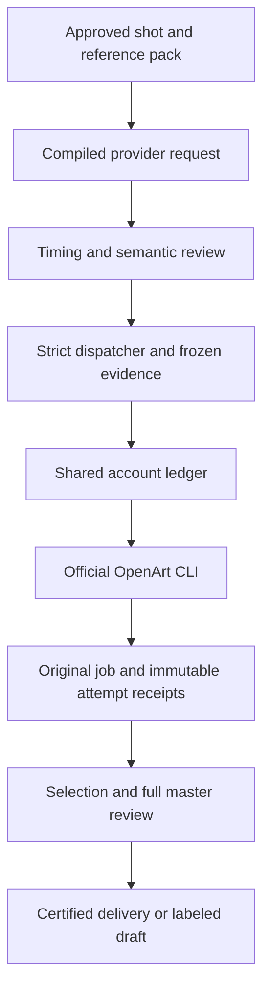
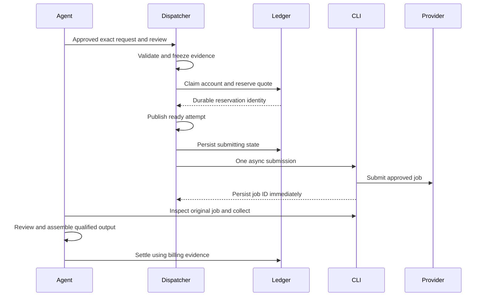
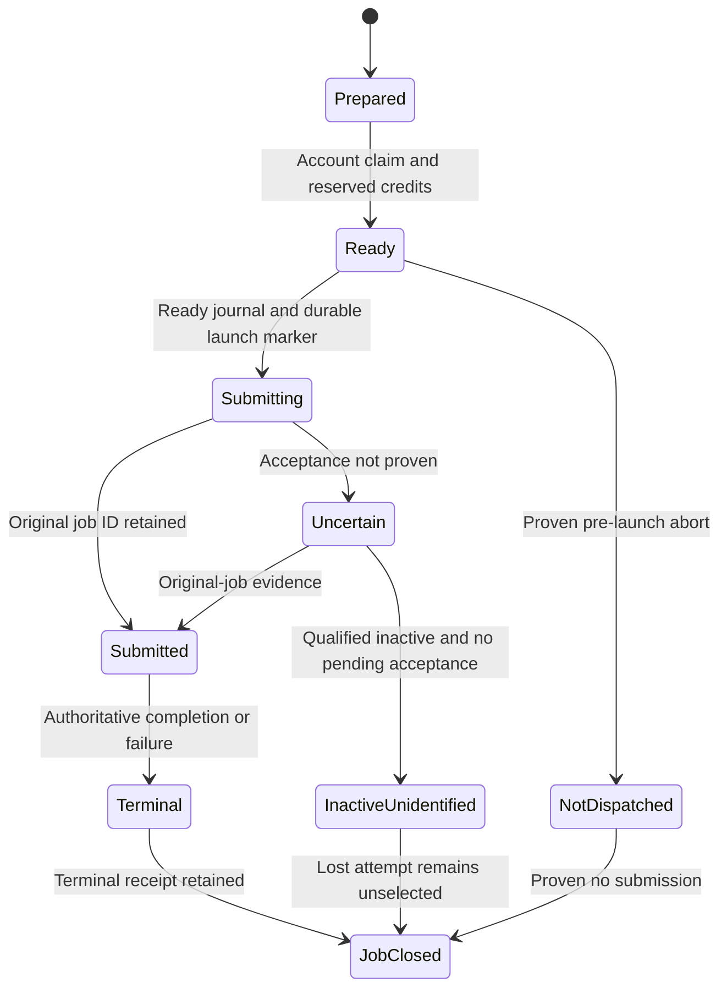
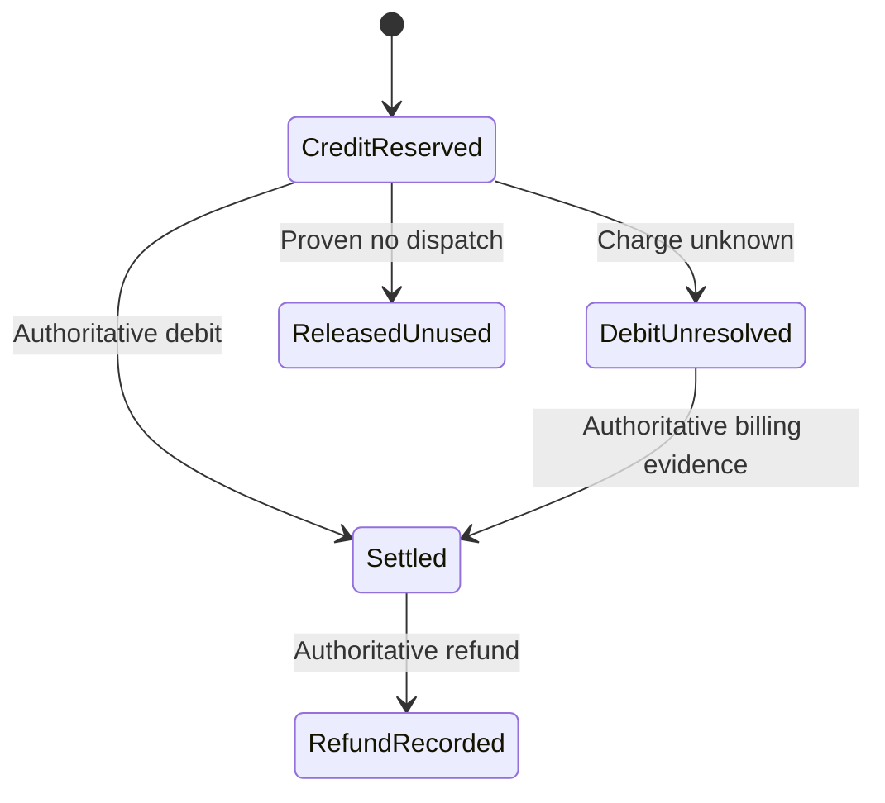

# OpenArt Factory - Plan

## Goal Capsule

**Objective:** Add OpenArt alongside Grok CLI as a first-class OpenMontage video option, so Social Studio can recommend and operate the right qualified route for an approved video while catching avoidable failures before spending.

**Means:** One official subscription-backed OpenArt CLI account integrated into OpenMontage, with reviewed request compilation and account credit control (KTD1–KTD6).

**Authority:** The user's automation requirement, clarified provider-choice experience and R1–R18 govern the product; KTDs govern implementation. On 2026-10-05, the user explicitly approved LFG end to end, including implementation after this plan phase completes. The accepted [Auto-continue amendment](2026-10-05-1833-openart-auto-continue-amendment.md) adds an optional upfront approval envelope and unit U5P. Readiness describes the plan's completeness and does not extend that authorization to separately gated paid activity.

**Execution status (2026-10-05):** LFG end-to-end approval is recorded; implementation may start once the plan phase completes. Begin with local development and offline validation. A subscription purchase and any paid benchmark dispatch still require the exact account/settings/count/cost qualification and authorization described below. Push and PR creation also remain separately gated.

**Stop conditions:** Unsupported required controls, unclear account ownership, missing cost evidence, ambiguous submission, or unavailable audiovisual review stop the affected operation with retained evidence. Resolve routine implementation details locally; surface changes to scope or approved production choices.

**Approval modes:** Strict remains the default. A valid, explicitly approved Auto-continue policy authorizes only its listed routes, flex dimensions, attempt caps, credit ceiling and checkpoint stages. Choices inside that envelope are announced and logged before use; anything outside it stops for a decision. Root accepts R18's narrow additional Strict guard: a pending, running or uncertain video attempt blocks another video attempt for that same shot across providers, including an unpublished ledger reservation. Existing prior-attempt checks gain matching production-kind isolation so explicitly approved other phases remain independent; unknown kinds fail closed, and no scope or repair authority is enlarged.

**Tail ownership:** The implementation orchestrator owns integration and independent code review. The user authorizes the live benchmark and any shipping action.

| Milestone | Outcome | Spending gate |
|---|---|---|
| 1. Discover | Install/check official CLI and capture account-visible H3 forms, IDs and quotes | One-time OAuth; try a free account first; no generation |
| 2. Build | Adapter, durable jobs and qualified original-attempt recovery | Offline fixtures and fake CLI only |
| 3. Prepare and protect | Reviewed exact requests, timing checks and shared account ledger | Offline concurrency/crash proof |
| 4. Qualify | Fixed Turbo/Max comparison and an automated collect/review/assembly path | Separate exact benchmark approval; start one month of Pro here if needed |
| Later: pool | Evaluate multiple accounts from measured throughput and economics | Separate plan and isolated-auth proof |

---

## Product Contract

### Summary

Add a governed OpenArt video route that Codex can operate from preparation through collection and delivery.
Expose it alongside the existing Grok CLI route in the same Social Studio production conversation and OpenMontage provider menu.
Improve first-generation acceptance by reviewing the exact reference pack and provider request before spending.
Use one OpenArt account first and measure Turbo/Max acceptance and economics to inform recommendations; retain Grok as an eligible option according to its own qualified controls and billing path.

### User Experience

The user continues working in Social Studio: choose a concept, refine the joke/story and cast, inspect the reference boards, approve a concrete production plan, then review the assembled video. OpenMontage supplies the provider options and executes the approved route through the official CLIs.

1. Codex inspects the video's requirements and the currently eligible routes: Grok CLI and qualified OpenArt H3 Turbo/Max. It recommends a route for the sequence, or an explicit provider mapping for individual shots when a different route earns its place.
2. The recommendation explains the supported controls, account readiness, creative/continuity tradeoffs and available cost evidence. It distinguishes measured results from expectations; no route is declared best for dialogue, action or price without appropriate evidence.
3. The user sees the exact provider/model mapping, references, shot duration/settings, attempt allowance and spending information. OpenArt credits and Grok subscription/media-cost status stay separate; unknown cost is never displayed as free or converted into a fabricated combined total.
4. After applicable approvals, Codex prepares provider-specific requests, uploads approved references, submits, checks jobs, downloads and assembles. The user manages creative choices and the allowance rather than CLI commands, job IDs or download files.
5. Existing production gates review cast, action completion, dialogue/speakers, audiovisual quality and the complete story. Using both providers is permitted only through an explicit approved mapping and reviewed continuity; an assembled file is not automatically certified.
6. A blocked or failed route produces a concrete diagnosis and proposed next action. Switching provider/model or generating a corrective attempt requires matching authorization; collection of a known original job continues without generating again.
7. The user can optionally approve Auto-continue up front: exact eligible providers/models, locked cast/dialogue/story, permitted duration/resolution/reference flex, OpenArt credits, attempt caps and named checkpoint stages. Codex may continue within that envelope, logging compromises and reporting actual choices, costs and remaining quality findings. Without a valid policy, Strict applies. Unknown paid acceptance still blocks a duplicate video attempt.

Prefer continuity within a sequence when it matters. Provider mixing is an available tool, not a requirement to use every model. Benchmark reports inform the agent's recommendations without adding an automatic learned router.

The referenced C75 chat illustrates the user's operating style. Repairing that episode, migrating its production state or building a new Social Studio UI is outside this implementation's scope.

### Problem Frame

An available model is not enough to make a dependable production route.
Lost job IDs, unbound prompt changes, unverified model controls and project-only budgeting can waste subscription credits or make an output impossible to certify.
Existing strict governance supplies useful foundations, but it does not yet qualify OpenArt or reserve account credits across projects.
This planning turn has not run OpenArt jobs or measured OpenArt credit waste; these controls are preventive, grounded in the existing governance gaps.

### Key Decisions

- **Subscription CLI automation** (session-settled: user-directed — chosen over manual website generation: production must run through Codex/OpenMontage). Governs R1, R2.
- **One account before pooling** (session-settled: user-directed). Account isolation and observed economics should justify later expansion. Governs R8, R13.
- **Improve preparation within existing pipelines.** Extend enforceable artifacts and director/reviewer guidance rather than introduce another creative orchestrator. Governs R5–R7.
- **Benchmark before choosing a default.** Advertised pricing and stability heuristics do not establish accepted-footage economics. Governs R11.
- **One production workflow with multiple explicit provider options.** Keep creative identity in Social Studio and recommendation with Codex; expose qualified Grok/OpenArt routes, pin the approved mapping and retain provider-specific billing. Governs R2, R12, R14.

### Requirements

**Automated route and truthful capabilities**

- R1. After one-time official authentication, Codex/OpenMontage must automate OpenArt reference uploads, quoting, generation and job inspection through the subscription CLI, then collect outputs and assemble/deliver through qualified engine paths.
- R2. Register an explicit OpenArt video provider with exact model/mode/settings selection; a missing required control blocks generation without website or API substitution. Strict requires approval for model/provider changes; Auto-continue permits only independently validated choices inside R15–R18, never selector fallback.
- R3. Preserve each submission's original account, governed attempt, request, native arguments, reference bindings and job evidence across process interruption; uncertainty never authorizes a second submission.
- R4. Expose inspect, quote, dry-run, status, collection, original-attempt recovery and evidence-backed attempt resolution as agent-accessible operations that do not consume generation attempts or create additional credit reservations.

**Preparation and review**

- R5. Compile approved dialogue, speaker/reference roles, initial state, action, completed state, continuity and invariants into the exact supported provider request, with traceable coverage of every required element.
- R6. Before dispatch, validate speech and action feasibility against the actual clip duration and available model controls; an impossible or unreviewed timing plan blocks spending.
- R7. Require a named review bound to the actual reference pack, resolved upstream inputs and compiled request; changed bytes or controls invalidate that review.

**Account and production governance**

- R8. Enforce an atomic account-credit allowance across governed OpenMontage projects sharing this installation's state directory, with at most one credit-consuming generation in flight for the account through those dispatchers.
- R9. Bind an exact settings-specific credit quote and ceiling to dispatch, then reconcile using observed billing evidence; unknown charges retain their hold and refunds require evidence.
- R10. Qualify OpenArt provenance for existing selection and final-certification gates without weakening current-byte, cast, dialogue, upstream or complete audiovisual review requirements.

**Validation and boundaries**

- R11. Provide a fixed, separately authorized Turbo/Max benchmark that reports first-attempt acceptance, zero corrective-video-regeneration deliveries, credits per accepted second and failure reasons.
- R12. Keep credentials and account runtime state outside Git, while keeping engine mechanics separate from Social Studio brand, cast, continuity and delivery identities.
- R13. Retain durable account affinity and an eligibility seam for later pooling, without implementing rotation, multiple logins or a pool in this release.
- R14. Present qualified Grok CLI and OpenArt CLI options through the existing production conversation/menu, with exact models/controls, readiness, limitations, separate cost units and evidence for recommendations. Support an explicitly approved route per sequence or shot, preserving that mapping through dispatch, collection, assembly and review without scoring overrides or hidden fallback.

**Optional Auto-continue**

- R15. Bind an optional upfront policy to immutable per-shot baselines, exact eligible routes, locked must-haves, explicit flex, an OpenArt credit ceiling, attempt caps and named checkpoint stages. Missing, revoked, stale or invalid policy means Strict.
- R16. Derive and revalidate exact scopes, compiled requests, preparation reviews and OpenArt credit terms from that policy before every dispatch; choices inside it need no new question.
- R17. Prove preserved cast, dialogue, source, story and locked native controls from actual bindings. Missing quality evidence remains visible; exhausted caps produce an uncertified draft.
- R18. Block another strict motion/video attempt for the same shot across providers while an original is pending, running or uncertain, reading private ledger outbox reservations before journals. No TTL or unsupported attestation releases the block. Other shots and non-video phases remain independent.

The [accepted amendment](2026-10-05-1833-openart-auto-continue-amendment.md) is normative for R15–R18, policy/checkpoint schemas, derivation and AE9–AE22. It authorizes no purchase, paid benchmark, publication or shipping.

### Key Flows

- F1. **Prepare and dispatch.** Per R2, R5–R9: discover eligible controls → resolve the approved shot and references → compile → inspect feasibility → review the pack/request → approve exact scope → reserve one account slot and credits → submit once.
- F2. **Collect after interruption.** Per R3, R4, R9, R10: reopen retained state → verify account/attempt/job bindings → poll the original job → preserve verified output → perform selection review → assemble and review the complete master. Reconcile billing independently while retaining unresolved credit holds.
- F3. **Unknown submission.** Per R3, R8, R9: retain the attempt and account hold → inspect provider history → reconcile only with unambiguous original-job evidence → report unresolved state if identification is insufficient.
- F4. **Choose providers for one video.** Per R2, R9, R10, R12, R14: inspect qualified choices → recommend the route/mapping with reasons and separate billing → review references and exact requests → retain concrete provider-specific approvals → pin each dispatch → collect and review original clips → assemble the approved story and certify only when all required evidence passes.

### Acceptance Examples

- AE1. **Covers R2, R5–R7.** A required ending frame or native speech control absent from the account's CLI form prevents dispatch; prompt wording cannot stand in for the missing control.
- AE2. **Covers R3, R4.** A known job completes after a local timeout; collection resumes the same attempt without generating again or consuming another allowance.
- AE3. **Covers R3, R8, R9.** Submission exits without a job ID and history is ambiguous; the account remains held and the agent reports the missing evidence instead of retrying.
- AE4. **Covers R8, R9.** Two projects compete for one account; only one can dispatch, and a request exceeding its approved credit ceiling sends no generation command.
- AE5. **Covers R5–R7.** A line or reference changes after review, or dialogue cannot fit the clip; generation is blocked until a matching approved package exists.
- AE6. **Covers R10, R11.** A downloaded clip with failed speaker or endpoint review is recorded as rejected; transport success never becomes first-attempt acceptance.
- AE7. **Covers R2, R9, R14.** A shot requires an ending-frame pin that OpenArt has not qualified; the menu reports OpenArt ineligible and can recommend a qualified Grok route for approval. It never silently changes an approved OpenArt dispatch, drops the pin or displays unknown cost as zero.
- AE8. **Covers R2, R10, R14.** A production explicitly approves a Grok shot and an OpenArt shot through separate matching scopes. Each dispatch uses its approved provider/model, preserves its own provenance and billing, and enters the same reviewed assembly path. A crossed scope, model substitution or unapproved provider fails before generation.

AE9–AE22 are defined in the [accepted Auto-continue amendment](2026-10-05-1833-openart-auto-continue-amendment.md#acceptance-examples), including bounded provider choice, immutable baseline locks, duplicate blocking, exact caps, truthful checkpoint preauthorization, Grok-native preparation and Strict regressions.

### Success Criteria

The release candidate passes offline proofs for AE1–AE22 and exposes the full automated control path, including provider choice alongside Grok, an explicitly approved mixed-provider fixture and optional Auto-continue within a retained approval envelope.
Live qualification requires account-side evidence and the authorized benchmark; offline success alone is not live compatibility or creative success.
The benchmark establishes an initial acceptance/economics baseline and compares Turbo with Max; it does not independently prove that preparation improved acceptance over an earlier workflow.

### Scope Boundaries

Initial OpenArt coverage is video generation plus reference upload and job/account inspection.
Approved local references or existing approved image routes can supply the reference pack; adding OpenArt image-generation breadth is follow-up work.
Assembly uses already qualified local paths and existing certification policy (R10).
Use the current Codex conversation and Backlot views. Provider-menu metadata and production guidance are in scope; episode-specific repair, legacy project-state migration, a new Studio UI and broader audience-analytics automation are not.

**Deferred to Follow-Up Work:** Full account pooling; distributed/multiple-machine credit coordination; a new learned model-ranking policy; generalized trim/reframe/audio-repair provenance; monotonic upgrades from provisional audio review; unrelated provider refactors.

<!-- ce-section: work-relationships -->
### How This Work Fits Together

This plan owns the single-account engine route and its qualification.
The wider factory direction remains subject to evidence and later planning.

- Account pooling **depends on** stable job affinity and isolated credential/refresh behavior; its usefulness follows measured wait times and accepted-footage costs.
- Social Studio identity work **can proceed independently**; it supplies creative rules when a production identity is selected, per R12.
- Broader edit provenance **shares** existing selection/final gates, but does not gate the first provider release.

---

## Planning Contract

### Key Technical Decisions

- KTD1. **Use an official CLI transport and one concrete video adapter.** Add `tools/_openart_cli.py` and `tools/video/openart_cli_video.py`, following BaseTool discovery and explicit provider pinning. Use argv-only subprocess execution, bounded parsers and retained JSON diagnostics. Serialize all official CLI invocations through one installation transport lock because they share refreshable credentials. Verify account identity around submit and during collection; quarantine any mismatch. Advertise only account-verified controls under R2; missing compatibility or auth makes the provider unavailable rather than guessed.
- KTD2. **Separate read-only commands from governed generation.** Add an inspection/collection control surface, proposed `tools/openart_account.py`, and a pure request-preparation hook. Current strict dry runs bypass provider bodies in `tools/base_tool.py`; add an optional OpenArt preparation hook returning retained quote evidence or quote-required without submitting or reserving. Preserve the existing bypass and result behavior for other providers. Live quote refresh is an explicit read-only command, distinct from an offline zero-provider-call rehearsal (R4, R9).
- KTD3. **Store compilation in a versioned sidecar.** Add `lib/production_request.py` plus schemas for a compiled request and named preparation review. Preserve the closed shot-contract schema's existing meaning. Bind the sidecar to contract planning digest, actual request digest, supported native controls, reference hashes/roles, source script/dialogue IDs, and resolved upstream output/review hashes (R5, R7). Retain the CLI dry-run native request, including effective creative defaults, and bind its digest, CLI version, account tier and model-form evidence into review and quote records. Set exposed creative controls explicitly and invalidate evidence after version, tier or form changes.
- KTD4. **Separate semantic judgment from structural enforcement.** Agents assess shootability, story coverage and reference suitability. Python checks declared coverage, exact bindings, required predicates and feasible timing intervals. Use measured approved audio duration where available; otherwise retain language/speech-rate assumptions, action time and margin in a named feasibility review. Require that review rather than pretending a word-count heuristic proves acting or speech quality (R6).
- KTD5. **Use a private shared transactional ledger.** Add `lib/provider_credit_ledger.py` using SQLite in one configured installation state directory outside the checkout. Key records by observed stable account identity, workspace/billing scope when applicable, project, attempt UUID and request digest. Use provider-reported credit precision, transactional reservation/settlement and a unique active account claim. Keep project USD estimates as display/accounting information, not the credit guard (R8, R9, R12).
- KTD6. **Bridge the filesystem journal and ledger with recoverable dispatch states.** Validate compilation in pure preflight and again against frozen snapshots. Prepare immutable evidence, then acquire a short ledger transaction for the account claim and credit reservation. Publish the ready attempt and persist `submitting` before invoking the CLI. Define one lock order, prohibit account-to-project callbacks under a ledger transaction, and keep network work outside project locks and ledger transactions; the separate transport lock serializes official CLI calls. A reconciliation outbox repairs interrupted journal/ledger publication; SQLite and filesystem writes are not claimed to be one transaction (R3, R8, R9). Every OpenArt generation entry point, including direct calls from unenrolled projects, must refuse submission without an active strict attempt and matching ledger reservation. This provider-specific guard preserves existing providers' legacy paths.
- KTD7. **Qualify original jobs and receipts explicitly.** Extend `lib/production_execution.py` and `lib/production_provenance.py` with OpenArt-specific native argument, job and output validation. Before launch, open unique durable stdout/stderr receipt files in the private installation state directory outside the checkout, bind them to the attempt, route child output directly to those files, and record process identity with start-time evidence. Persist job ID as soon as parsed, before a final ToolResult. Recovery first replays retained output and checks the original process without trusting a reused PID; no parent-owned pipe is the sole receipt. Project journals, manifests and diagnostics retain redacted receipts plus opaque private-receipt identifiers and integrity digests; tokens and signed-URL credentials never enter those project copies. A collection operation targets the original attempt and account; it cannot call generic strict `resume_job` or generation. Known IDs recover automatically. Unknown IDs require a provider-supported correlation/idempotency mechanism or unambiguous receipt evidence; broad timestamp/prompt similarity is insufficient (R3, R10).
- KTD8. **Collect asynchronously without regenerating.** Submit with documented async support, use creation status/result operations, and download returned outputs automatically into unique project paths. Do not combine async submit with the synchronous output flag. If job inspection supplies result URLs rather than a download command, engine HTTPS retrieval of those exact CLI-returned URLs is permitted collection, without a generation API call. Qualify that result contract before paid enablement. Reject non-HTTPS and private-network targets; validate resolved targets and URL/redirect hosts at every hop, enforce reserved output containment, never forward OAuth credentials to result hosts, and bind bytes/metadata to the original job. Preserve raw receipts only in private installation state and publish atomic local files before selection. Download/poll failures remain recoverable transport failures on the same attempt (R1, R3, R4).
- KTD9. **Expose benchmark results without silently retuning routing.** Store a machine-readable benchmark manifest/report under a project, using existing strict approvals, attempt records and AV reviews. Report per-model outcomes and all attempts, including failures; no measured-score substitution into `lib/scoring.py` in this release (R11).
- KTD10. **Extend the existing provider-choice seam.** Report compact qualified-route controls/limitations, discovery evidence, readiness and billing-unit/unknown-cost metadata in the registry menu. OpenArt uses the existing explicit-selection-only selector seam with matching `preferred_provider` and singleton `allowed_providers`, or direct canonical dispatch; ordinary preference scoring must not change the approved route. Existing provider-specific scopes can express an approved mixed-provider production. Keep comparative recommendation in agent guidance, with each clip's provider/provenance retained through selection and final review (R2, R10, R14).

### High-Level Technical Design

The diagrams summarize KTD1–KTD8; the owning requirements and decisions remain authoritative.

Job evidence and credit accounting are separate state axes, not one shared enum. Only qualified original-job output can become selectable; a closed unidentified attempt remains unselected regardless of billing settlement. Account quarantine is independent of both axes.

The Uncertain state has no retry edge.
By R8–R9, the claim remains active until authoritative no-dispatch or terminal evidence permits release; unresolved billing retains its credit hold even after the generation slot can be released. An operator may attach provider evidence through a named resolution operation, never edit the ledger by hand. Slot release requires verified original-process termination and qualified provider evidence excluding active jobs and pending or delayed acceptance of that invocation. Exhaustive history may contribute only when its qualified contract supplies that guarantee; an empty current job list alone cannot unlock the account. Release leaves the lost attempt unselected and its credit hold unresolved. Human attestation, timeout or a worst-case debit alone cannot prove that no job is running. Without sufficient provider evidence, report the held account and paused benchmark as a supported failure outcome.

Billing settlement is independent of output selection, assembly and final audiovisual certification. Unknown billing retains the credit reservation and prevents evidenced settlement or refund, but does not invalidate otherwise complete original-job provenance. Further dispatch must satisfy the remaining allowance after all unresolved holds. Report footage acceptance separately from billing completeness; credits per accepted second remains incomplete while charges are unresolved.

An authoritative debit above the reservation or approved ceiling is recorded in full, never clamped to the quote or mislabeled unknown. Mark a quote/budget violation and quarantine the account against new generation. Terminal job evidence can release the generation slot without clearing quarantine. Explain the pricing discrepancy and obtain renewed exact authorization before any paid continuation; accounting the charge never retroactively authorizes it.

### Assumptions and Discovery Gates

- The local ledger coordinates only governed OpenMontage dispatchers sharing the configured installation state directory. Direct official-CLI use on this machine, website use and other-machine spending are outside its control. Refresh provider balance before dispatch and halt on unexplained divergence from the ledger; this detects drift but cannot prevent an out-of-band concurrent charge. Distributed/provider-enforced exclusivity is deferred.
- Public documentation establishes nonspending cost queries, but not exact quote validity, immutable submit pricing, per-job debit/refund evidence or every settings dimension. Before paid dispatch, qualify the exact settings-specific quote, a rule ensuring its reservation covers the possible charge, and the available billing-evidence mechanism with unknown-state handling. Actual debit/refund amounts are observed after submission; absent per-job billing retains holds and makes economics incomplete rather than blocking qualified footage review. Do not fabricate a quote or treat aggregate balance movement as per-job truth when other activity exists.
- Qualify reference upload as nonspending before enabling it. A credit-consuming upload is unsupported in this initial route until separately authorized credit governance covers it; discovery must report that gate rather than spend outside the ledger.
- Exact H3 Turbo/Max model IDs, native audio, duration choices, first/end-frame support, rich references and prompt-expansion controls are account-side gates. Use the actual operation-mode tokens returned by discovery. Other providers' H3 APIs do not establish OpenArt CLI capabilities.
- Try free-account catalog/forms/dry runs first. Public docs do not promise free access; if a required probe is Pro-gated, report that exact gate and the remaining risk before the user subscribes. After upgrade, rerun nonspending discovery and native dry runs before benchmark approval.
- Unknown-submission automatic recovery is an execution-time qualification gate, not an assumed feature. Safe unresolved holding satisfies R3 without inventing a resubmit route. Qualify exhaustive-history slot resolution in U1/U2 if supported; otherwise the operational runbook keeps the account paused until provider evidence is available.
- Complete AV review availability is a live qualification gate. Before benchmark dispatch, demonstrate synchronized viewing/listening and the intended certification path on existing media without new paid generation, retaining real reviewer evidence rather than synthetic fixture judgments. Existing provisional-audio policy may produce a labeled draft only with its required authorization; it cannot certify delivery or be counted as accepted benchmark footage.

### Benchmark Proposal and Subscription Timing

Propose six predeclared short shot cases, each run once on Turbo and once on Max: identity/action, short exact dialogue, feasible speaker handoff, completed prop action, continuity, and payoff/reference sensitivity.
Use the same approved semantics and reference bytes for paired cases, while retaining each model's exact compiled request.
Freeze a balanced submission order before results are viewed: alternate which model runs first across the six paired cases, three starting with Turbo and three with Max.

The candidate allowance is **12 total video attempts at 768p/5 seconds, no corrective attempts, with a 1,800-credit ceiling** if account quotes confirm 100 Turbo and 200 Max credits.
These are proposed settings, not approved spending.
If capability parity, duration or quotes differ, revise and obtain exact settings/count/cost approval before running; do not quietly weaken a case.
Use approved existing references; separately quote any additional paid reference or audio generation. Count uncertain submissions in the attempted denominator, report their unresolved billing separately, and pause the frozen remaining order without substitutions or retries.

Report these metrics separately for each model with numerator, denominator and evidence; an aggregate may be additional context:

- First-attempt acceptance: reviewed clips passing all required AV/story predicates divided by attempted clips; retain transport failures in the total and report them separately.
- Zero corrective-video-regeneration delivery: the share of predeclared deliverables certified using the permitted original video attempts. This is a certification count under the benchmark's corrective-generation ban, not an observed reduction in reroll propensity or a claim of one continuous camera shot.
- Credits per accepted second: that model's observed charged credits across all its attempts divided by its accepted source seconds, counted once per accepted attempt. The paired model's matching shot is a separate attempt; repeated use of one output in assembly adds no source seconds. Report unknown billing separately.
- Failure reasons: capability, preparation, identity, dialogue/speaker, action endpoint, continuity, technical/transport and review availability.

Six pairs provide a diagnostic sample, not a statistically established acceptance rate or provider-wide reliability claim.
Do not select a production default from advertised prices alone.
When any charge is unresolved, label the economics incomplete and show known charges and outstanding holds instead of a complete cost ratio.
If a stop leaves any predeclared attempt unresolved or unrun, retain partial results without a completed model-comparison conclusion. Resume only the frozen, unattempted cases after the blocker clears and the original approval remains current. Changes to settings, counts, allowance, compiled/native requests, reference bindings, CLI version, account identity/tier or model-form evidence invalidate benchmark approval and require renewed exact authorization.

As of the October 5 public pricing check, Pro is $56 monthly for 24,000 credits; $44 is the annual-billing equivalent. H3 Turbo/Max are advertised at 100/200 credits for 768p/5s. These are advertised rates, not observed debit. [OpenArt pricing](https://openart.ai/pricing)
Start one month of Pro after the adapter and offline proof are reviewed and the benchmark is ready, unless a disclosed entitlement gate requires an earlier subscription decision.

### Sources and System-Wide Impact

The [official OpenArt CLI documentation](https://github.com/OpenArt-AI/cli/blob/main/README.md) supplies the command contract; retain the installed release/version and observed forms as compatibility evidence.
Current repository foundations are `tools/base_tool.py`'s governed wrapper, `lib/production_execution.py`'s preflight/journal/reconciliation, `lib/production_provenance.py`'s qualified receipts, and `lib/shot_contract.py`'s named predicates.
`tools/provider_jobs.py` is a persistent-job pattern, not sufficient strict provenance by itself.
`tools/cost_tracker.py` supplies project USD accounting and cannot serve as an atomic account-credit ledger.

Changes affect direct tools, selector delegation, strict dry runs, immutable attempts, runtime state and final eligibility.
Extend provider-specific behavior without changing legacy diagnostics or other providers' approval rules.
Borrow account eligibility, quota/cooldown and lease concepts from CodexCommander only when needed by R13; no Bun proxy or account-rotation dependency enters OpenMontage.
The initial eligibility seam reports verified identity/capabilities, available balance, active claim and quarantine status; it adds no rotation or cooldown machinery.

---

## Implementation Units

Build U1 → U2 → U3 → U4 → U5 → U5P → U6. U2 component proofs use a fake reservation interface; U4 owns real ledger/slot invariants and U5 owns integrated sign-off. Assign shared dispatcher edits sequentially to one integration owner rather than parallel writers.

### U1. Official CLI discovery and transport

**Goal:** Establish the account-visible compatibility envelope and nonspending control surface.
**Requirements:** R1, R2, R4, R12; AE1.
**Dependencies:** Implementation approval; one-time user OAuth where required.
**Files:** New `tools/_openart_cli.py`, `tools/openart_account.py`, `tests/tools/test_openart_cli_transport.py`, `schemas/tools/openart_account.schema.json`, `docs/OPENART_CLI.md`; modify `tools/base_tool.py` and strict dry-run regression coverage in `tests/lib/test_production_execution.py`.
**Approach:** Implement KTD1–KTD2 transport/inspection; capture version/help/account/model forms/quotes/dry-run records with redacted diagnostics. Qualify async result retrieval, upload billing and exhaustive-history completeness as explicit capability gates. Keep account identity separate from credential contents. Document exact unsupported gates and observed modes.
**Patterns:** `tools/_grok_cli_media.py`, BaseTool contracts and `docs/plans/2026-09-10-grok-system-cli-and-imagine-plan.md`.
**Test scenarios:**

- Missing binary, incompatible JSON/help or expired auth makes inspection unavailable and launches no generation.
- Model forms lacking requested pins/audio reject the request, covering AE1.
- Read-only discovery/quote operations do not reserve an attempt or credits.
- Retain the provider's nonspending quote contract and inspect balance before/after a quote on a quiet account with no governed job active. Unexpected movement halts qualification for investigation; an unchanged immediate balance alone does not prove that delayed billing is impossible.
- Argument metacharacters are passed as data; secrets and signed URLs are protected/redacted. Verify current-user ownership and private directory/file modes for runtime directories, receipt files and SQLite side files; unsuitable existing state fails closed.
- Concurrent inspect/quote/status/submit invocations cannot race credential refresh; changed account identity quarantines the attempt.
- Offline dry run reports retained quote provenance or quote-required; explicit refresh remains nonspending.
- Other providers retain their existing strict dry-run bypass/results; the optional OpenArt hook performs no submission or reservation.

**Verification:** Fake-CLI boundary tests pass; authorized account discovery records exact capability and price evidence without generating media.

### U2. Governed video jobs, collection and provenance

**Goal:** Submit once and collect/reconcile original OpenArt attempts after interruption.
**Requirements:** R1–R4, R10, R13; F2–F3; AE2–AE3.
**Dependencies:** U1. Paid enablement additionally requires U3–U5.
**Files:** New `tools/video/openart_cli_video.py`, `lib/openart_jobs.py`, `schemas/tools/openart_cli_video.schema.json`, `tests/tools/test_openart_cli_video.py`, `tests/lib/test_openart_jobs.py`; modify `lib/production_execution.py`, `lib/production_provenance.py`, `tests/lib/test_production_execution.py`, `tests/lib/test_production_provenance.py`.
**Approach:** Implement KTD7–KTD8. Add durable event/job receipt persistence and explicit attempt-targeted collect/reconcile. Qualify original arguments, references, account, native job and output evidence before selection. Use mock receipts and a fake reservation interface for component proofs; production launch refuses a missing reservation until U4 connects the real ledger.
**Patterns:** Immutable execution journal, original Grok reconciliation, `tools/provider_jobs.py` polling semantics.
**Test scenarios:**

- Successful async submit retains stdout/job evidence even when the parent dies before parsing.
- Unenrolled or direct generation without the matching strict reservation is rejected before CLI launch.
- Known-job timeout/resume and download retry preserve the original attempt, covering AE2.
- Lost job ID with ambiguous history holds without a second submit, covering AE3.
- Wrong account/job/request or changed reference/output bytes reject reconciliation and selection.
- Qualified original-job footage with complete AV review can pass selection/certification while billing remains unknown; the ledger keeps its credit hold and economics stays incomplete.
- Partial download, expired result URL and output-preservation failure retain raw evidence and recover the same job.
- Non-HTTPS/private-network targets, redirected/unapproved result hosts, credential forwarding and paths escaping the reserved project output are rejected.
- Raw child receipts survive in private installation state; project receipt/journal/benchmark copies omit tokens and signed-URL credentials while preserving verifiable private evidence bindings.
- Resolution evidence validation rejects a still-running original child and empty history that cannot exclude delayed acceptance; U4 proves the actual ledger release. Human attestation cannot unlock uncertainty.
- Provider failure remains an attempted generation; no success boolean authorizes repair or acceptance under R3 and R10. U5 owns failed speaker/endpoint acceptance proof.

**Verification:** A fake-CLI interrupted workflow yields exactly one submission and qualified current-byte provenance; all negative receipt cases fail closed.

### U3. Shootable request compilation and bound preparation review

**Goal:** Preserve approved intent in the actual provider request before credits are at risk.
**Requirements:** R5–R7; F1; AE1, AE5.
**Dependencies:** U1 and U2's native request builder.
**Files:** New `lib/production_request.py`, `schemas/artifacts/compiled_request.schema.json`, `schemas/artifacts/preparation_review.schema.json`, `tests/lib/test_production_request.py`; modify `lib/production_execution.py`, `skills/creative/visual-development.md`, `skills/meta/reviewer.md` and relevant existing pipeline director guidance.
**Approach:** Implement KTD3–KTD4 as a sidecar and OpenArt video dispatcher prerequisite. Record coverage, language/timing assumptions, evidence, margins and required semantic predicates. Review actual references and the resolved provider request, including upstream bindings, before final approval. Other providers retain their existing preparation gates.
**Execution note:** Begin with contract fixtures that demonstrate a dropped line and stale reference review; synthetic review data stays labeled test-only.
**Test scenarios:**

- A supported request retains every approved line, speaker mapping, endpoint, invariant and reference role in the compiled coverage map.
- Missing semantic coverage or infeasible dialogue/action windows block dispatch, covering AE5.
- Changed prompt, native control, effective CLI dry-run request, CLI version, tier, form, reference, upstream output or review invalidates preparation evidence.
- An unsupported end-frame/audio field is rejected rather than dropped, covering AE1.
- Existing image bootstrap and legacy diagnostic paths retain their prior gate behavior.

**Verification:** Complete bound preparation passes, while each missing/stale prerequisite results in zero generation commands.

### U4. Account-credit ledger and crash-safe dispatch

**Goal:** Protect one account's credit allowance across project/process races.
**Requirements:** R4, R8, R9, R12, R13; F1–F3; AE3–AE4.
**Dependencies:** U1–U3.
**Files:** New `lib/provider_credit_ledger.py`, `tests/lib/test_provider_credit_ledger.py`, `tests/integration/test_openart_dispatch_recovery.py`; modify `lib/production_execution.py`, `tools/openart_account.py`, `schemas/tools/openart_account.schema.json`, `tests/lib/test_production_execution.py`.
**Approach:** Implement KTD5–KTD6 with versioned ledger/outbox records. Recheck exact quote/ceiling/account balance at dispatch and reuse one reservation through nested selector calls. Define release, charge, refund and unknown states from observed provider evidence. Add `openart_account` action `resolve_attempt`, taking the original attempt ID and retained evidence references. Validate account/attempt/request bindings and distinguish job identification, proven inactive/no-pending acceptance and billing settlement. Append resolution events and repair the existing reservation only; never submit or infer one state axis from another.
**Execution note:** Prove races and every persistent boundary before enabling real submit.
**Test scenarios:**

- Two processes/projects sharing an account produce one claim and at most one submit, covering AE4.
- Nested selector/provider dispatch reserves once; over-ceiling, insufficient balance and stale/wrong-setting quotes send no generation.
- Crashes before/after reservation, ready journal, launch marker, provider acceptance, job ID and settlement reconcile without duplicate submission.
- Parent death with a live child or delayed provider acceptance cannot release the slot based on currently empty history.
- Uncertain acceptance cannot expire into a free slot; authoritative terminal evidence releases only eligible state, covering AE3.
- Duplicate settlement/refund is idempotent; failed jobs with debit and unknown charges retain correct accounting.
- A terminal job with unknown debit releases only its eligible generation slot, retains its credit reservation and allows further dispatch only within the remaining allowance.
- Debit above the quote or ceiling is recorded without clamping, marks a violation and blocks new paid dispatch even after the terminal slot is released.
- `resolve_attempt` accepts qualified original-job/no-pending or billing evidence for its matching transition; wrong-account, mismatched/stale evidence, human attestation, timeout and a worst-case debit cannot release an unsupported slot or credit hold.
- Fractional precision, negative/boolean amounts, identity change and external balance drift reject invalid accounting.

**Verification:** Offline concurrent/crash tests prove the stated single-controller guarantees; durable states remain inspectable and balances never rely on project WARN-mode USD reserves.

### U5. Registry, selector and end-to-end release proof

**Goal:** Make the route usable from normal OpenMontage pipelines with complete governed evidence.
**Requirements:** R1, R2, R4, R10, R12, R14; F1–F4; AE1–AE8.
**Dependencies:** U1–U4.
**Files:** Modify `tools/tool_registry.py` where reporting needs qualified-control, readiness, billing-unit or job fields, `tools/video/video_selector.py` only where adaptation needs verified controls, `tests/tools/test_video_selector_routing.py`; add `tests/contracts/test_openart_cli_contract.py`, `tests/integration/test_openart_first_pass_workflow.py`; update `AGENT_GUIDE.md`, `skills/INDEX.md`, `docs/OPENART_CLI.md`; add `skills/creative/prompting/openart-prompting.md` and `.agents/skills/openart-cli/SKILL.md` for provider Layer 2/Layer 3 guidance.
**Approach:** Use automatic provider discovery, singleton exact provider pinning and verified schema adaptation. Implement KTD10 menu metadata and guidance for qualified route recommendations, separate billing units and approved per-sequence/per-shot mapping. Expose preparation, quote, pending-job, billing and collection context to the agent. Demonstrate review/assembly/certification through existing qualified paths without new creative identity rules or a new Studio UI.
**Test scenarios:**

- Explicit OpenArt selection uses one exact supported model and preserves all approved settings without fallback.
- Provider menus expose Grok and OpenArt controls/readiness/limitations and their separate billing paths; unknown cost remains unknown rather than zero, covering AE7.
- An approved OpenArt route cannot fall through preference scoring or selector fallback when another provider scores higher or OpenArt becomes unavailable.
- A fake-provider workflow dispatches distinct approved Grok/OpenArt shots through matching scopes and reviewed assembly; crossed scopes/providers fail before calls, covering AE8.
- Missing required controls remain visible in provider/selector reports and block before reservation.
- An interrupted strict workflow prepares, submits, collects, reviews and assembles with original attempt continuity.
- Missing full AV review or failed speaker/endpoint evidence produces a labeled draft and cannot certify, covering AE6.
- Existing Grok, selector, first-pass and provisional-audio boundaries pass unchanged.

**Verification:** Offline integration and repository checks pass; independent review accepts the substantive diff before any paid qualification.

### U5P. Optional Auto-continue approval policy

**Goal:** Continue approved video work within an explicit envelope while preserving exact requests, budget guards and honest quality gates.
**Requirements:** R15–R18, R2, R9, R14; AE9–AE22 and AE1/AE6–AE8 regressions.
**Dependencies:** Accepted U4 allowance/outbox integration and U5 qualified menu metadata.
**Files and approach:** Follow the [amendment's U5P contract](2026-10-05-1833-openart-auto-continue-amendment.md#u5p-auto-continue-policy-new-unit): new pure policy helper and closed schema; sequential narrow edits to production request/preflight, Grok-native preparation and checkpoint authority; guidance on Strict default and upfront Auto-continue setup. U4-owned ledger and credit modules remain unchanged.
**Verification:** Offline schema, immutable baseline/delta, native lock, retiming, caps, cross-provider duplicate, checkpoint-hash and mixed-report tests. Use executable fake CLIs and current-byte media evidence; no real generation. A model other than the implementer reviews baseline authority, locks, duplicate prevention and checkpoints.

### U6. Fixed live benchmark and operational qualification

**Goal:** Measure usable-footage economics and demonstrate the real automated route.
**Requirements:** R1, R3, R9–R11; F1–F3; AE6.
**Dependencies:** U5 and U5P plus the exact separate benchmark approval, qualified account capabilities and demonstrated complete AV review on existing media without new paid generation. Benchmark projects remain Strict and reject an Auto-continue policy.
**Files:** New `schemas/artifacts/provider_benchmark.schema.json`, `tests/lib/test_provider_benchmark.py`, `lib/provider_benchmark.py`, `docs/OPENART_BENCHMARK.md`; runtime manifests, receipts, footage and reviews under the benchmark project.
**Approach:** Implement KTD9 and the Benchmark Proposal. Compile/review the fixed paired cases and quote the final manifest before dispatch. Automate collection and existing qualified assembly, then report failures and measured debit honestly.
**Test scenarios:**

- Fixture reports compute each metric per model from all its approved attempts and accepted source seconds counted once per attempt; an aggregate cannot replace the paired comparison.
- Failed, missing-review, billing-unknown and zero-accepted-second cases never imply success or invented cost.
- Changed settings/count/allowance, compiled/native request, reference bindings, CLI version, account identity/tier or model-form evidence invalidates benchmark approval; no corrective attempt is permitted.
- An uncertain submission remains counted and pauses the remaining order; partial results are labeled incomplete rather than a completed comparison.
- A partial or unbalanced set cannot select a model default; resumption preserves the frozen remaining order and still-current exact approval.
- Authorized live runs retain actual quote/debit, job IDs, original outputs and complete AV reviews.

**Verification:** Deliver the fixed report and evidenced certified deliverables or clearly labeled drafts; disclose any unsupported capability, unresolved debit or recovery limitation.

---

## Verification Contract

Run verification during implementation, not this planning turn.
Use the repository's configured interpreter and network-disabled/fake-provider fixtures for all offline generation paths.

| Boundary | Required evidence |
|---|---|
| U1–U2 | New transport/video/job tests plus existing Grok CLI media, diagnostics and provenance regressions |
| U3 | Compiled-request tests plus `tests/lib/test_shot_contract.py` and strict preflight tests |
| U4 | Multiprocess credit-ledger tests and dispatch crash-recovery integration tests |
| U5 | OpenArt contract/integration tests plus `tests/integration/test_first_pass_workflow.py`, production execution/provenance/review, draft-audio and video-selector regressions |
| U5P | Amendment policy/delta/lock/cap, cross-provider duplicate and checkpoint authority tests; existing Strict OpenArt/Grok regressions |
| U6 | Offline benchmark metric/approval tests, then only the separately approved live manifest |
| Repository | `make lint`, `make test-contracts`, `make test`, and `git diff --check` using the configured environment |
| Independent review | Review brief, substantive diff and check results; give auth/credit/provenance boundaries focused review by a model other than their implementer |

No UI changed, so browser testing is unnecessary.
No JavaScript `release:validate` script applies to this Python provider work.
Source research and inherited past passing tests do not count as checks of the new implementation.

---

## Definition of Done

- U1–U5P produce a reviewed release candidate with the specified offline proofs and documented account discovery results.
- Paid enablement requires exact capability/quote contracts, all required preparation gates and the separate benchmark allowance.
- U6 qualifies the operational route through observed results; unresolved account capabilities, billing or AV review are reported honestly and are never described as production certification.
- Each unit satisfies its Verification and applicable Acceptance Examples; R1–R18 remain traceable through the final diff.
- Social Studio can present qualified Grok/OpenArt choices, explain separate billing and operate an approved provider mapping through existing production and review surfaces.
- No credentials or private runtime state enter Git, no abandoned experimental code remains, and no extra identity or pooling feature is introduced.
- The handoff states what is implemented, what was tested offline/live, what footage was accepted and what remains unresolved.
