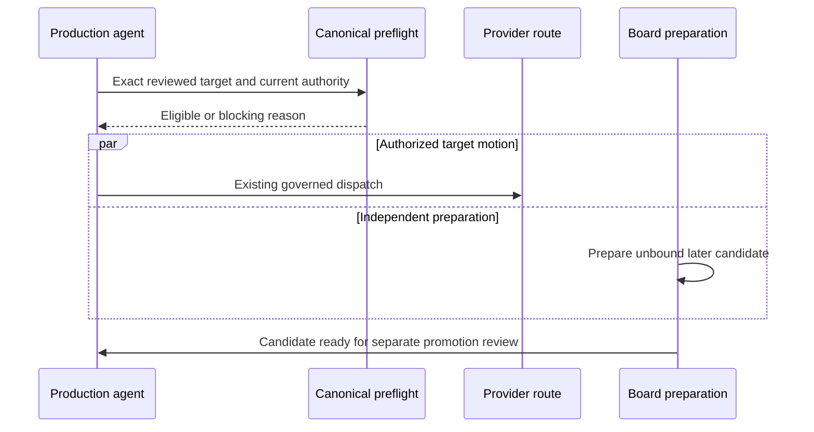
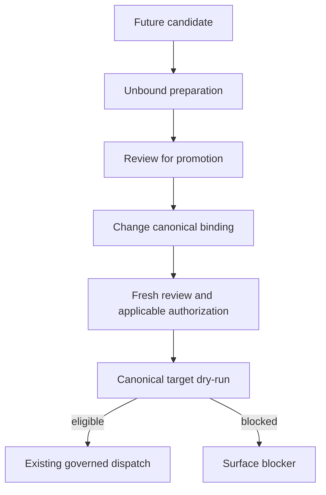

# Reviewed Shot Preparation Overlap - Plan

## Goal Capsule

- **Objective:** Production agents can start an authorized, reviewed video shot while preparing independent later board candidates.
- **Means:** Document and characterize existing fixed-plan target-shot preflight (KTD1).
- **Authority:** The user request and protected production instructions govern scope; `AGENT_GUIDE.md` governs production; this plan governs maintenance only.
- **Execution profile:** Synthetic offline verification and a task-only reviewed change.
- **Stop conditions:** An unsupported current preflight assumption, a change required to authorization semantics, or a change to active production returns to the coordinator before expansion.
- **Completion owner:** The coordinating agent reviews, verifies and ships the maintenance change, then reports the supported boundary to the Social Studio fix chat.

---
## Product Contract

### Summary

Make existing overlap usable through a concise operational skill and an offline integration regression.
The supported overlap prepares unbound future candidates while the complete authored plan and its approvals remain fixed.
Independent per-shot immutable approval is a separate requested capability.

### Problem Frame

Agents can mistake a whole-package board review convention for a requirement to wait before beginning an eligible shot.
The current engine checks the target shot and shared prerequisites, but changes to later authored board bindings can still stale global approval or compilation.
Instructions must expose that distinction without implying that speculative boards are production inputs.

### Key Decisions

- **Preserve active C77:** Maintenance remains outside the active production checkout and run. (session-settled: user-directed — chosen over altering or restarting C77: the user explicitly forbids changes to its production.) Governs R5.

### Requirements

**Overlap and eligibility**

- R1. A reviewed target shot may proceed under its current exact authorization while independent later board candidates are prepared without modifying canonical authored artifacts or bound input bytes.
- R2. Target inputs, shared project review, payoff and late-cast identity prerequisites remain mandatory under canonical preflight.
- R3. A dependent shot waits for the current selected upstream attempt, matching observed outgoing-frame bytes and required continuity review.
- R4. Promoting a candidate that changes authored path, hash or semantics requires the existing fresh review, compilation and applicable authorization process; overlap never preserves an approval that canonical preflight rejects.

**Protection and maintenance**

- R5. C77 projects, footage, checkpoints, attempt counters, selections and approvals remain untouched by this maintenance.
- R6. Implementation approval grants no paid generation, image generation, automatic production approval, publication, purchase or resubmission authority.
- R7. The change ships separately from preexisting dirty OpenArt work and preserves all existing governance behavior.

### Acceptance Examples

- AE1. Covers R1, R2. Given a complete schema-valid frozen contract, passing target and shared prerequisites, and a future shot lacking local review, the target dry-run passes while the future target fails.
- AE2. Covers R1, R4. Creating or editing an unbound future candidate leaves target eligibility and global bindings unchanged; promoting a changed authored board binding stales the old approval.
- AE3. Covers R3. A provisional planned board cannot substitute for the selected upstream outgoing frame.

### Scope Boundaries

This work covers instructions, discoverability and synthetic regression for the behavior in R1-R4.
No production scheduler, readiness ledger, exported helper, new scope version or digest relaxation is introduced.
Canonical dry-run already supplies the eligibility decision, so a second readiness state would create another authority without closing a demonstrated gap.

#### Deferred to Follow-Up Work

The upstream handoff requests independent per-shot immutable scopes, external source-lineage binding and provider-aware reduced endpoint roles.
Those requests remain valid follow-ups, but none is required for unbound candidate preparation under R1.
Existing reference-guided routes and shot review do not establish those capabilities.
Social Studio policy/template/checker maintenance belongs to its named fix chat; this task supplies the verified engine boundary.

### Sources

The external origin is the Social Studio research document titled “OpenMontage requirements handoff — shot preparation (2026-10-07)”, basename `2026-10-07-shot-preparation-engine-handoff.md`.
Its dirty-working-tree observations are source evidence, not a shipped support claim.
Current source and tests below establish this plan's narrower approach.

---
## Planning Contract

### Key Technical Decisions

- KTD1. **Use existing target-shot validation under a fixed complete plan.** `lib/shot_contract.py:110` validates the requested shot's closure. `tests/lib/test_shot_contract.py:255` explicitly permits an entry shot while a future handoff lacks review. A new immutable-scope design would solve unrelated authoring changes, which R1 does not require.
- KTD2. **Keep candidate preparation outside canonical bindings.** `approval_plan_digest` in `lib/production_execution.py:393` binds authored metadata globally, omitting only reviewed evidence and observed serial handoff facts. The operational skill must identify that boundary and use canonical dry-run immediately before dispatch, per R1-R4.
- KTD3. **Add a synthetic integration proof without provider traffic.** Reuse `tests/integration/test_first_pass_workflow.py`'s governed fixtures and native transport boundary. Use a new focused test file so existing dirty implementation is not captured accidentally. Fixture attestations establish software enforcement only.
- KTD4. **Isolate shipping from the active working baseline.** Use the clean managed worktree `/Users/pavel/.codex/worktrees/reviewed-shot-overlap/openmontage`, branch `codex/reviewed-shot-overlap`, based on fetched `origin/main` (`a5b062f` at planning). That baseline already supports target-shot readiness. Apply only this task's new files and small pointer changes; do not publish the active checkout's 32 preexisting unpushed commits. Keep the active checkout and its uncommitted OpenArt integration intact, per R5 and R7.

### High-Level Technical Design

### Assumptions

Later-board preparation means preparing candidates, not independently accepting new authored bindings while old approvals remain valid.
Preparation may include separately authorized image production, but this maintenance authorizes none (R6).
No dependency installation, new API or provider research is necessary for the existing local governance path.

### System-Wide Impact

Production agents and the Studio fix chat receive a supported sequencing recipe rather than a new execution mode.
The source-of-truth engine checks stay unchanged.
Current C77 has provisional S01 selection and a completed original S02 whose review and selection remain unresolved; the original production chat owns that work.
This observation is coordination context, not a quality or certification claim.

---
## Implementation Units

### U1. Characterize fixed-plan overlap

**Goal:** Prove R1-R4 with offline governed integration coverage.

**Requirements:** R1-R4, R7; AE1-AE3.

**Dependencies:** None.

**Files:** Create `tests/integration/test_shot_preparation_overlap.py`; reuse the existing fixtures and transport boundary in `tests/integration/test_first_pass_workflow.py` without moving unrelated code.

**Approach:** Under KTD1-KTD3, exercise canonical governed dry-run and the existing target validation. Keep all projects in temporary fixture directories. Assert zero provider calls, reservations and production attempts for dry-run checks.

**Execution note:** Establish passing characterization before changing instructions. Do not weaken production validation to make the test pass.

**Patterns to follow:** `tests/lib/test_shot_contract.py:255`, `tests/integration/test_first_pass_workflow.py:505`, `tests/lib/test_production_execution.py`.

**Test scenarios:**

1. Covers AE1. Remove a future shot's review while keeping valid schema and target/project reviews; target dry-run passes and future-target dry-run fails.
2. Covers AE2. Write and change a later candidate at an unbound fixture path; target dry-run remains eligible and authored contract, source artifacts and scope remain unchanged.
3. Covers AE2. Promote a later static board by changing its authored binding; the old exact scope fails rather than gaining per-shot immunity.
4. Remove the shared payoff review or required late-cast identity evidence; target dry-run fails despite independent future preparation.
5. Change a bound target byte or remove target review; target dry-run fails with no dispatch side effects.
6. Covers AE3. Substitute a provisional board for the selected upstream outgoing-frame source; dependent target fails.

**Verification:** All positive and negative checks use canonical paths and synthetic evidence, with side effects proven absent.

### U2. Document the supported overlap recipe

**Goal:** Give agents enough guidance to use the behavior proven by U1.

**Requirements:** R1-R6.

**Dependencies:** U1.

**Files:** Create `skills/meta/shot-preparation-overlap.md`.

**Approach:** Explain KTD1-KTD2 through eligibility, preparation, promotion and continuity boundaries. Include a short operator sequence: identify independent work, retain a fixed canonical plan, validate target and shared closure, perform fresh canonical dry-run, then use existing governed dispatch only under production authority. State that planning or preparation cannot establish observed upstream evidence. Keep quality and generation-consent rules linked to their existing owners.

**Patterns to follow:** `skills/meta/checkpoint-protocol.md`, `AGENT_GUIDE.md`, `skills/creative/visual-development.md`.

**Test expectation:** No new behavior in this unit; U1 verifies every engine claim.

**Verification:** A cold reader can distinguish candidate preparation from promotion and knows when canonical preflight blocks further motion.

### U3. Expose the recipe without changing production gates

**Goal:** Make the operational skill discoverable at existing planning and board-preparation entry points.

**Requirements:** R1, R4-R7.

**Dependencies:** U2.

**Files:** Small additive pointers in `skills/INDEX.md`, `AGENT_GUIDE.md`, and `skills/creative/visual-development.md` only where existing blanket wording would conceal target-specific overlap.

**Approach:** Link the new skill next to the current shot-contract and board-review guidance. Qualify any implication that every unrelated local shot review must finish before target motion, while retaining R2-R4. Under KTD4, bring only these task additions into the isolated worktree; do not carry dirty OpenArt core hunks into its commit or PR.

**Test expectation:** No gate changes; U1 and the existing governance regressions verify the instructions' claims.

**Verification:** Task-only diff contains the focused test, new skill, plan and narrowly scoped pointers. Existing production state and unrelated dirty changes remain outside it.

---
## Verification Contract

Use the repository's Python test runner in the isolated worktree.
Use the existing environment interpreter `/Users/pavel/tools/openmontage/.venv/bin/python` from the isolated worktree, without installing dependencies or modifying the live environment. The focused proof is `python -m pytest tests/integration/test_shot_preparation_overlap.py`.
Regression coverage is `python -m pytest tests/lib/test_shot_contract.py tests/lib/test_production_execution.py tests/integration/test_first_pass_workflow.py`. The fetched-main baseline lacks the newer prompt compiler and its test module; compiler-specific assertions are outside this characterization. Where an installed route enforces compilation, the operational instructions require fresh compilation through that route after a canonical change, without claiming this task verifies that compiler.
All evidence remains synthetic and offline; no result establishes provider quality or live production readiness.

A fresh reviewer checks the Product Contract, task-only diff and check results.
Review the new operational skill for authorization parity, target/shared closure, candidate promotion and observed upstream evidence.
Confirm the final diff excludes dirty OpenArt implementation and active project artifacts.
No release-validation script has been established as necessary for this documentation and characterization change; honor applicable repository checks discovered during implementation.

---
## Definition of Done

- U1 proves eligible fixed-plan overlap and fail-closed candidate promotion through canonical code.
- U2 and U3 teach the same supported boundary without broadening production authority.
- Appropriate offline regressions pass and an independent reviewer resolves substantive findings.
- The task-only commit or PR contains no unrelated OpenArt changes and does not alter C77.
- No abandoned experimental code remains in the final diff.
- The coordinator reports the verified current engine boundary to the already-authorized Social Studio fix chat.
