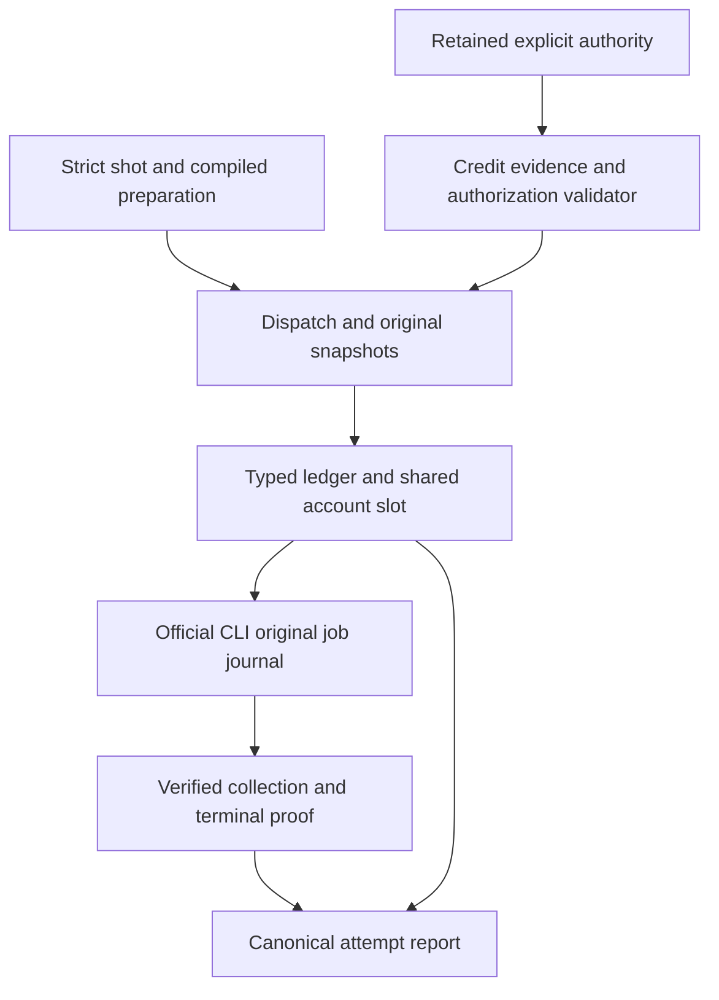
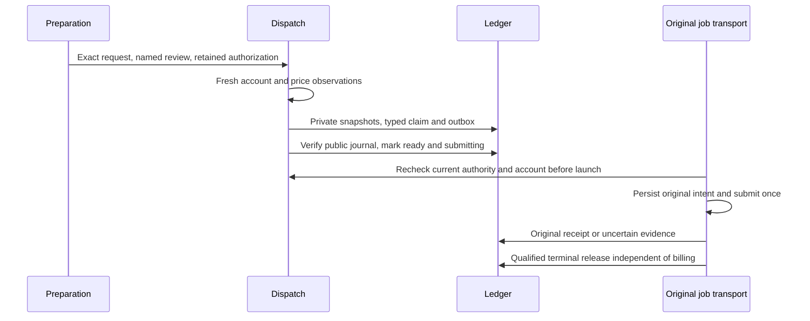
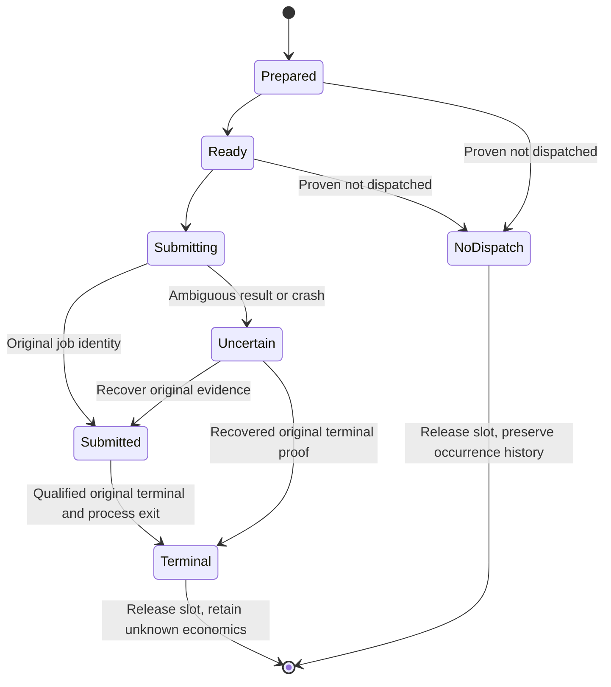
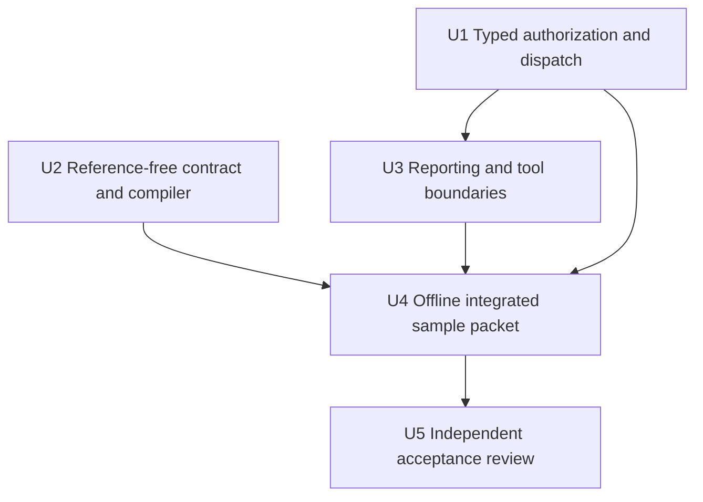

# OpenArt Unknown Cost Generation - Plan

## Goal Capsule

- **Objective:** A user can prepare an honestly priced, explicitly authorized OpenArt CLI video attempt through OpenMontage and recover its original result without duplicate generation.
- **Means:** Add a separate unknown-cost authorization and account claim, with guarded reference-free preparation (KTD1, KTD2, KTD3).
- **Authority:** The user's approved practical-credit amendment governs this plan. Product requirements govern behavior; technical decisions govern implementation within those requirements.
- **Execution profile:** Local code, offline checks, independent review, and an exact sample approval packet. R9 defines the live boundary.
- **Stop conditions:** Surface contradictory approval bindings, an uncertain original attempt, or evidence invalidating a settled decision. Preserve evidence and stop dependent work.
- **Tail ownership:** The parent integrates and independently reviews all changes. The user owns the separate live sample approval; actual generation and production qualification remain subsequent work.

---

## Product Contract

### Summary

Enable the official OpenArt CLI route alongside the existing Grok route when the CLI cannot establish a conservative exact credit quote.
The user opts into unknown charge exposure for exact requests and bounded attempts.
The accepted amendment's Product Contract meaning is unchanged; this new plan supplies implementation details without rewriting the proposal or previous approved plans.

### Problem Frame

Read-only OpenMontage inspection succeeded against OpenArt CLI 0.1.1 for PixVerse V6 text-to-video at 1s, 16:9, 720p.
The account observation was Free with 40 credits, while the returned 50-credit price described 5s/540p defaults.
Neither the requested charge nor Free-plan generation entitlement is established.
Existing credit guards demand maximum-charge, exact-settings and billing-scope guarantees absent from those responses, and the strict shot contract also assumes reference boards.
These guards currently prevent the user from using a working authenticated CLI route.

### Requirements

**Authorization and honest economics**

- R1. Preserve existing exact-quote authorization, hard ceilings and retained Auto-continue semantics; no existing approval may become unknown-cost authority.
- R2. Add explicit unknown-cost approval bound to account identity, exact provider/model/mode, native settings and request hashes, applicable reference hashes, project/story/scope/shot, purpose, and attempt occurrences/caps.
- R3. Unknown-cost authority acknowledges that no enforceable credit ceiling exists. Unknown charge is never encoded or displayed as zero, a guaranteed estimate, affordability, or a USD conversion.
- R4. Capture fresh account and available price evidence before launch. Distinguish settings-matched estimates, mismatched default prices and missing price evidence; a mismatched price neither proves affordability nor proves insufficient funds.

**Submission and recovery**

- R5. Both authorization modes share one active slot per provider/account, across billing workspaces and projects. Persist prelaunch authority and original attempt evidence before dispatch; consume occurrences once and refuse uncertain resubmission.
- R6. Keep terminal footage/process recovery separate from billing. Qualified original terminal evidence may release the slot while charge remains unknown; neither release nor a balance delta fabricates settlement.
- R7. Retain authoritative per-job billing when actually available. Otherwise label before/after balance evidence as an unattributed account change; external activity defeats attribution. Any optional soft stop affects future launches only and never guarantees the next charge.

**Preparation and acceptance boundary**

- R8. Allow strict text-to-video only under an explicit reference-free contract whose creative requirements need no image reference, start/end pin or upstream frame. Preserve prompt coverage, timing, native controls, preparation review and actual footage review; reject conflicting requirements rather than invent boards or uploads.
- R9. This implementation performs no credit-consuming provider call, upload, purchase, top-up, paid API fallback, website generation, publishing or PR push. Prepare one PixVerse V6 original text-to-video sample at 1s, 16:9, 720p, no upload and zero repairs for later exact live approval.
- R10. A staged real profile may use the exact sample's explicitly authorized result-contract-qualification purpose without pretending a result is already qualified. Only collected original bytes and observed provider receipts can later promote its actual result contract.
- R11. A provider-confirmed insufficient-credit or unavailable-plan result stops the sample. Ambiguous errors remain uncertain and never justify a repeat. One second proves transport and collection only, not production quality.
- R12. Report these facts through canonical registered-tool and attempt/report surfaces with private raw receipts and public opaque hashes. Preserve Grok's existing unknown remaining subscription quota semantics.

### Key Decisions

- **Official CLI route.** Governs R9, R12. (session-settled: user-directed — chosen over website generation: the user requires OpenMontage through official OpenArt CLI alongside Grok.)
- **Explicit opt-in.** Governs R2, R3, R4. (session-settled: user-approved — chosen over waiting indefinitely for unobserved quote fields: the actual CLI cannot supply the extra exact-quote guarantees.)
- **Hard approvals retain their meaning.** Governs R1. (session-settled: user-approved — chosen over silently loosening previous approvals: a credit ceiling remains a ceiling.)
- **Unknown exposure remains unknown.** Governs R3, R7. (session-settled: user-approved — chosen over treating estimates as guarantees: the observed price covers different defaults.)
- **One original launch.** Governs R5, R6. (session-settled: user-approved — chosen over repeated or untracked calls: durable recovery must prevent duplicates.)
- **Reference-free T2V.** Governs R8. (session-settled: user-approved — chosen over a dummy approved board: the requested sample has no given reference.)
- **Local implementation and one later sample.** Governs R9, R10, R11. (session-settled: user-approved — chosen over an extra H3 benchmark or paid batch: proposal approval authorizes local implementation only, and final exact test approval remains separate.)

### Acceptance Examples

- AE1. Covers R1, R2. Given an old ceiling approval, selecting unknown-cost dispatch fails before claim or submission; a new explicitly retained unknown-cost approval can prepare its exact occurrence.
- AE2. Covers R3, R4. Given a 1s/720p request and a 5s/540p price of 50 credits with observed balance 40, the report shows mismatched price evidence and unknown requested charge without declaring affordability or insufficient funds.
- AE3. Covers R5, R6. Given a crash after launch intent, recovery inspects only the original attempt and blocks a second launch until qualified resolution permits slot release; billing may remain unknown afterwards.
- AE4. Covers R8. Given an explicit reference-free shot, compilation succeeds with no synthetic assets; adding a required start pin, identity reference or upstream frame causes pre-reservation refusal.
- AE5. Covers R9, R10. Given the completed implementation, the sample packet contains reviewed exact prompt/native settings and one capped qualification occurrence, but records no live approval, result proof, uploads or generation.

### Scope Boundaries

R9 defines the authorized implementation boundary.
The prior H3 paired benchmark remains separate and unchanged.
Existing approved plans are historical authorities and are not edited by this work.

#### Deferred to Follow-Up Work

Real sample execution, collection and result promotion follow separate exact approval.
Production batches follow real qualification and fresh bounded authority.
Optional unknown-cost Auto-continue requires a new explicitly approved policy variant only after real route qualification; this plan neither activates it nor migrates hard-ceiling policies.
Image-to-video and uploads require their own observed compatibility and charge/nonspending evidence.
An optional user-selected soft stop can be added later; observation records must remain compatible with R7.

### Sources

- Approved amendment: `docs/plans/2026-10-07-openart-practical-credit-proposal.md`. Its draft header predates the user's approval; the approved conversation establishes local implementation authority, not live authority.
- Actual retained read-only evidence: `docs/implementation/2026-10-07-openart-cli-smoke.json`.
- Existing governance: `AGENT_GUIDE.md`, `lib/openart_credit.py`, `lib/provider_credit_ledger.py`, `lib/openart_dispatch.py`, `lib/openart_jobs.py`, `lib/production_request.py`, `lib/production_execution.py`, `lib/production_autonomy.py`.

---

## Planning Contract

### Key Technical Decisions

- KTD1. **Discriminated authorization.** Under R1-R4, use a new versioned unknown-cost branch or sidecar with an explicit discriminator and required exposure acknowledgement. Retain v1 exact-quote parsing and digests unchanged. Unknown occurrences bind the request/native/profile and retained evidence, without quote amounts, allowance or ceiling fields. Account/workspace observations are typed facts; absent workspace is an observation, never a provider account-global billing guarantee.
- KTD2. **Separate typed unpriced claims.** Under R5-R7, add an unpriced binding/proof and durable ledger records sharing the existing account claim, occurrence and evidence-affinity gates. Never use an exact `Binding` with zero amounts. Evolve the SQLite schema additively with an atomic versioned upgrade that preserves old bindings, events and reservations; refuse unknown versions or unsafe state files. Unknown account observations must not enter exact-mode balance arithmetic or silently clear an exact-mode quarantine.
- KTD3. **Explicit reference-free shot variant.** Under R8, introduce a tagged shot-contract variant with empty references permitted only when there are no cast identity obligations, dialogue, required frame pins, upstream dependencies or reference-driven payoff requirements. Legacy absence of a tag keeps current board requirements. A simple completed noncast action still has reviewed initial/action/end text and story predicates. This reaches schema and semantic validation as well as compilation; deleting only the compiler rejection cannot suffice.
- KTD4. **One lifecycle, independent economics.** Under R5, R6, R10, extend dispatch/outbox/recovery using the existing immutable request snapshot and launch journal. The trusted lookup advertises the authorization kind and qualification purpose. Maintain once-markers and original-job affinity for both kinds; terminal release and billing state remain separate dimensions.
- KTD5. **Evidence before arithmetic.** Under R4, R7, retain raw read-only account/cost receipts and explicit observed settings. Compare fields to the frozen native request and classify matching only when all cost-relevant settings are supported by evidence. Missing fields prevent a match. Unknown-cost preparation requires fresh valid account identity/balance evidence; malformed available price responses stop preparation rather than become estimates. Unsupported cost discovery is retained as unavailable evidence, without synthetic pricing.
- KTD6. **Canonical reporting without policy expansion.** Under R1, R12, add public unknown-cost summaries and strict attempt reports through existing tools/readers. The current autonomy policy compiler/activation must reject unknown-cost authority until the later policy variant exists. Exact reports continue to use exact accounting; unknown records never pollute ceiling totals.

### High-Level Technical Design

Component flow:

Protocol sequence:

Slot lifecycle:

The existing carefully qualified unidentified-inactivity close path may remain if its evidence gate is preserved; it never authorizes reusing a consumed occurrence.

Authorization branch and accounting matrix:

| Kind | Required financial proof | Durable record | Launch limit | Settlement |
|---|---|---|---|---|
| Existing exact quote | Existing conservative maximum and billing scope | Existing priced reservation | Existing ceiling plus occurrences | Existing qualified billing |
| New unknown cost | Fresh identity/balance and classified price evidence | Typed unpriced claim | Explicit occurrences and shared account slot | Actual per-job proof or unknown |

Work dependencies:

### Assumptions and Deferred Implementation Details

The observed CLI schema and receipts are sufficient to develop an offline account/price parser, but do not establish live generation entitlement or charge.
The implementation may choose final type names and table layout; it must preserve KTD1/KTD2's disjoint accounting and existing database integrity.
Exact output JSON paths for first-result qualification are execution-time facts from the one original job, not planning guesses.
The narrow reference-free variant may deliberately reject more complex cast/story cases until evidence and separate contract design support them.
No strategy, concepts or institutional-solutions documents were present in the bounded repository scope; provider behavior is grounded in the retained local smoke evidence, without new provider investigation.

### System-Wide Impact and Ownership

Credit and dispatch work is cohesive and belongs to one feature worker, including registered-tool metadata and reporting adapters.
A second worker owns shot-contract/schema/compiler changes and their tests.
Shared `lib/production_execution.py` edits belong to the feature worker; the compiler worker provides an explicit seam proposal rather than editing that file concurrently.
No worker reverts another's work.
The parent reviews both diffs, coordinates schema/public metadata seams, and owns integrated verification and sample evidence.
A fresh reviewer evaluates authorization, recovery and database changes independently of their implementer.

---

## Implementation Units

### U1. Typed unknown-cost authority and durable dispatch

**Goal:** Make R1-R7 and R10 enforceable through existing official CLI dispatch.

**Requirements:** R1-R7, R10; AE1-AE3; KTD1, KTD2, KTD4, KTD5.

**Dependencies:** None; agree the typed dispatch/lookup/public record seam before U3 consumes it.

**Owner and Files:** Feature worker owns `lib/openart_credit.py`, `lib/provider_credit_ledger.py`, `lib/openart_dispatch.py`, `lib/openart_jobs.py`, `lib/production_execution.py`, `schemas/artifacts/credit_authorization.schema.json`, a new unknown-cost evidence/authorization schema as needed, `tests/lib/test_openart_credit.py`, `tests/lib/test_provider_credit_ledger.py`, `tests/lib/test_openart_jobs.py`, `tests/integration/test_openart_dispatch_recovery.py`.

**Approach:**

1. Add KTD1's explicit authority variant and receipt evidence validation alongside the existing exact validator.
2. Add KTD2's unpriced claim persistence, atomic upgrade, affinity and shared slot operations.
3. Extend preparation, reservation, immutable private manifests, outbox reconstruction and prelaunch rechecks using KTD4.
4. Preserve original submission once-markers, uncertain holds, qualification purpose and independent terminal/billing reconciliation.

**Patterns to follow:** `ValidatedCreditAuthorization`, `ValidatedReservation`, ledger transactions, `reserve_dispatch`, `journal_ready`, `validate_prelaunch`, `launch_submit`, `_consume_qualification_marker`, `resolve_attempt`.

**Execution note:** Add characterization and refusal coverage before changing exact paths; inject transport/crash outcomes offline.

**Test scenarios:**

- Covers AE1. Old exact approval and digest remain unchanged; unknown selection cannot reuse it, omit acknowledgement or carry contradictory hard-ceiling fields.
- Covers AE2. The real 5s/540p-shaped price for a 1s/720p request stays mismatched and cannot gate available credit; missing settings stay unknown.
- Changed account, request, model, profile, reference, story, purpose, review evidence or occurrence index fails before reservation or launch.
- Exact and unknown claim races across projects/workspaces permit one active account slot; consumed occurrences cannot be duplicated.
- New schema upgrade preserves a populated legacy ledger byte meanings/events and replay behavior; transaction failure leaves a recoverable old or fully upgraded database, never partial state.
- Crash after private snapshot, ledger prepare, public journal publication, ready, submitting and Popen recovers the original journal without another process invocation.
- Covers AE3. Ambiguous timeout/error holds the slot and occurrence; a matching original terminal/process proof releases only the slot and leaves charge unknown.
- Per-job authoritative billing is retained only when bound to original account/job/request; unattributed balances never settle or refund a job.
- External balance changes do not bypass existing exact quarantine or get treated as unknown-job charges.
- Staged profile ordinary generation fails; qualification purpose requires exact retained authority and once-marker, and cannot be caller-forged.

**Verification:** Existing priced-reservation and exact quote suites pass; offline recovery assertions show exactly one mocked generation subprocess and preserved original evidence.

### U2. Explicit reference-free strict T2V preparation

**Goal:** Satisfy R8 through the entire contract/compiler path without fabricated boards.

**Requirements:** R8; AE4; KTD3.

**Dependencies:** Independent of U1; agree any necessary execution integration with its owner.

**Owner and Files:** Compiler worker owns `schemas/artifacts/shot_contract.schema.json`, `lib/shot_contract.py`, `lib/production_request.py`, `schemas/artifacts/compiled_request.schema.json` if needed, `tests/lib/test_shot_contract.py`, `tests/lib/test_production_request.py`, narrow reference-free fixtures under `tests/fixtures/first_pass/`.

**Approach:**

1. Add the explicit variant to schema and semantic validation while retaining default board-backed behavior.
2. Build source bindings and prompt coverage from real textual requirements and empty applicable references.
3. Permit only native text2video matching KTD3's predicates; preserve image2video and Grok reference paths.
4. Preserve named preparation review, timing and immutable historical/current source checks.

**Patterns to follow:** `validate_shot_contract`, `source_packet`, `_validate_compiled`, `validate_timing`, frozen preparation and source-review digests.

**Test scenarios:**

- Covers AE4. Explicit noncast/no-dialogue/no-reference completed action prepares at 1s with empty references and no synthetic payoff/start/end assets.
- Untagged legacy contracts missing boards fail with existing semantics.
- Required start/end pin, identity reference, cast/dialogue obligation, upstream frame or reference-driven payoff fails before provider dispatch.
- Native image upload/reference fields conflict with reference-free mode and fail rather than being ignored.
- Changed prompt fragment, source text, scene/script mapping, native model/settings, timing or review invalidates compiled and frozen preparation.
- Existing image2video and Grok compiler fixtures remain valid; removing a required reference remains rejected.

**Verification:** Contract and compiler suites demonstrate both the narrow positive path and unchanged reference-required behavior; semantic coverage uses no copied synthetic passing review as real evidence.

### U3. Registered-tool and canonical reporting integration

**Goal:** Make unknown exposure visible and prevent authority leaking into existing Auto-continue.

**Requirements:** R1, R3, R7, R12; KTD6.

**Dependencies:** U1's durable/public interfaces; U2 only for integrated preparation assertions.

**Owner and Files:** Feature worker owns `tools/openart_account.py`, `tools/video/openart_cli_video.py`, `schemas/tools/openart_account.schema.json`, `schemas/tools/openart_cli_video.schema.json`, `lib/production_autonomy_report.py`, `lib/production_autonomy.py` only for explicit refusal/compatibility, `schemas/artifacts/autonomy_policy.schema.json` only if needed to preserve refusal, `tests/tools/test_openart_account.py`, `tests/tools/test_openart_cli_video.py`, `tests/contracts/test_openart_cli_contract.py`, `tests/lib/test_production_autonomy_report.py`, `tests/lib/test_production_autonomy.py`.

**Approach:** Extend metadata allowlists and registered schemas consistently with U1, expose read-only typed evidence and original-attempt state, and label unknown economics according to R3/R7. Keep raw receipts private. Any strict report addition must read retained state without dispatch, outbox repair or ledger initialization. Preserve existing autonomy compilation/activation/refusal semantics rather than introducing the deferred policy variant.

**Patterns to follow:** Current registered account actions, opaque quote summaries, immutable historical preparation validation, existing read-only ledger snapshot/report code.

**Test scenarios:**

- Public report distinguishes unknown requested charge, mismatched price, observed balance and unattributed change without zero/ceiling/USD claims or raw account IDs.
- Terminal unknown claim is reported as original result/slot release with unresolved billing, not a settled priced reservation.
- Mixed exact/unknown historical state keeps exact totals unchanged; malformed authority/provenance fails closed.
- Report reads create no private state, make no provider calls and do not repair journals.
- Existing retained Auto-continue policy cannot accept unknown authority; no implicit migration or activation occurs.
- Registered schemas, tool metadata stripping and request hashes agree on new fields, including dry-run behavior.
- Existing Grok quota wording and exact OpenArt report assertions remain valid.

**Verification:** Contract/tool/report/autonomy tests pass with zero outbound generation and unchanged hard-ceiling decisions.

### U4. Integrated offline rehearsal and exact later-approval packet

**Goal:** Give the user a reviewable sample request under R9 without spending credits.

**Requirements:** R4, R8-R12; AE2, AE5.

**Dependencies:** U1, U2, U3 and passing targeted checks.

**Owner and Files:** Parent owns `tests/integration/test_openart_first_pass_workflow.py`, a narrow new unknown-cost integration fixture/test if clearer, a new `docs/implementation/2026-10-07-openart-unknown-cost-rehearsal.md` and adjacent machine-readable rehearsal evidence. Proposed sample workspace artifacts belong under `projects/` only when necessary and are not activated approval artifacts.

**Approach:** Rehearse the official registered OpenMontage tool path with stubbed generation, retain final exact prompt and native 1s/16:9/720p preview evidence, and prepare proposed authority with count one, qualification purpose and zero repairs. Distinguish proposed authority from retained user approval; the rehearsal must not mark live approval or fabricate result proof. Retain actual existing receipt hashes rather than manufacture current account/provider observations.

**Test scenarios:**

- Covers AE5. Integrated dry rehearsal reaches the approval-ready boundary with zero real generation subprocesses, zero uploads and no result promotion.
- Covers AE2. Sample packet clearly states the 40-credit observation date and default price mismatch; neither is a proven cap or current live affordability claim.
- A changed final prompt/native preview requires a new matching proposed authorization.
- Mocked insufficient-credit/unavailable-plan terminal rejection stops; ambiguous result remains uncertain with no automatic repair or resubmit.
- Original-job mocked collection validates output bytes/hash and separate transport review before selection; a file alone cannot certify story quality.

**Verification:** Retained evidence proves the zero-call boundary, exact request/settings, proposed approval status and absent live result. The sample is ready for a separate final approval only after independent acceptance.

### U5. Independent review and local acceptance

**Goal:** Accept the integrated change against the authorized scope and recovery invariants.

**Requirements:** R1-R12; AE1-AE5.

**Dependencies:** U4.

**Owner and Files:** Parent and fresh independent reviewer inspect U1-U4 diffs and test evidence. Parent owns any resulting integration fixes in coordination with existing file owners; no old approved plan or proposal is rewritten.

**Approach:** Review fresh evidence for authorization confusion, account-slot races, unsafe ledger migration, crash recovery, T2V weakening, privacy and inaccurate reporting. Reconcile all critical findings before completion and remove abandoned implementation paths.

**Test expectation:** No redundant reviewer-only tests; add meaningful regression coverage only when review exposes an unproven behavior.

**Verification:** Independent reviewer is not the feature implementer. Required offline repository checks pass, scope remains local, and the final report separates implemented capability from unexecuted live sample and deferred production qualification.

---

## Verification Contract

Implementation runs the repository's pytest harness against the concrete test files listed in U1-U4, using mocked CLI transport and private temporary ledger state.
Existing exact-credit, dispatch recovery, first-pass, tool contract, compiler and Auto-continue tests are mandatory regression evidence.
Run the full offline suite after integration; the parent's previously reported 3891/3910 passing runs establish a baseline, not validation of future edits.
Any repository-required security review applies to authority and ledger persistence changes.
No check may consume provider credits, upload media, buy a plan or activate an approval.
Assertions must count generation subprocesses and expose crash replay paths; a generic success flag is insufficient.
The parent records actual test totals and failures, fresh review findings, and the sample's zero-call evidence.

---

## Definition of Done

- U1: New explicit typed authority and claim work end to end offline; old quote/ceiling authority retains its semantics.
- U2: Reference-free strict T2V prepares without dummy assets, while every conflicting reference requirement still fails.
- U3: Registered tools and canonical readers tell the truth and existing Auto-continue cannot adopt unknown authority.
- U4: One exact sample approval packet and zero-call rehearsal evidence are retained, with live approval and result qualification explicitly absent.
- U5: Fresh independent review and applicable offline checks pass; critical findings are resolved and experimental code is removed.
- The final handoff names the remaining live approval boundary and does not claim actual video generation, unknown-cost Auto-continue activation or production qualification.
