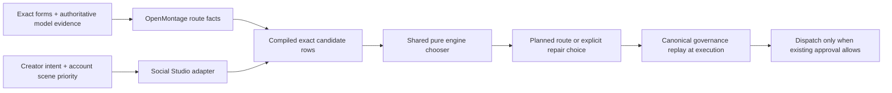

# Video Model Routing and Repair Decisions - Plan

**Target repos:** OpenMontage and the `thisaccountisawarcrime` identity in Social Studio. Studio file paths below are relative to that identity directory unless prefixed `Social Studio:`.

## Goal Capsule

- **Objective:** Scene routing and repair plans reflect exact provider capabilities and creator intent, while preserving the original evidence and approval boundaries.
- **Means:** OpenMontage owns one pure candidate-choice implementation; Social Studio supplies the current creator intent and account-specific scene priorities to it (KTD1).
- **Authority:** Exact connector forms and retained provider documentation establish capability facts; the activated episode policy, current story locks, canonical scopes, and counters remain authoritative for dispatch and repair.
- **Stop conditions:** Missing or conflicting capability evidence, incompatible exact requests, unresolved original jobs, absent repair decisions, or exhausted authorization blocks the plan. No planner result grants dispatch or billing authority.
- **Execution profile:** Offline planning and tests only. No provider generation, uploads, purchases, asset publication, or project job/scope/counter/contract mutation.
- **Completion owner:** Separate engine and Studio behavior owners implement their assigned units; a docs-only owner edits only documentation. A fresh reviewer checks both repos before changes are integrated into their `main` and `development` branches.

## Product Contract

### Summary

OpenMontage should distinguish what a model can produce from which controls a connector exposes, and should provide the single capability-aware route-choice mechanism used by both OpenMontage and Social Studio. Social Studio repair planning must name a defect-specific remedy instead of automatically selecting the first eligible alternate. Production speed guidance must preserve one accountable reviewer and focus dense inspection on uncertain intervals.

### Problem Frame

OpenArt forms expose explicit controls, but absence of an audio field has been reported as “no native audio.” That confuses connector control with model output behavior. Separately, Social Studio keeps its own ordered provider list and repair planner, which can duplicate engine decisions and currently chooses `alternates[0]` after its guards pass. Existing speed instructions already call for one producer, one substantive reviewer, and focused frame sampling, but should consistently bind the review verdict to later stage checks.

### Requirements

**Capability and route choice**

- R1. Represent audio output support, explicit audio-control availability, reference-audio support, and empirical result status independently for each exact model/mode route. A missing form property means no exposed toggle; it does not by itself mean audio output is unsupported.
- R2. Use official source evidence for a documented implicit/default output capability. For H3 Max Turbo, preserve that the official H3 Max announcement describes natively synchronized audio/video while the observed OpenArt text and image forms expose no audio toggle. Keep output/dialogue quality and empirical result status unverified. Do not invent an OpenArt parameter from a different endpoint’s `target_audio_url` soundtrack-replacement field.
- R3. Audit other no-toggle routes with the same evidence rule. Mark a default as documented only when an applicable authoritative source supports it; otherwise retain unknown. Never require a paid generation result as a prerequisite to plan an otherwise compatible route.
- R4. OpenMontage owns one pure candidate ordering/choice helper over already compiled exact candidate rows, goal/intent, approved pool, and account scene priorities. Its existing model selector and Social Studio use that helper. Studio carries creator intent and account-specific scene priority; it does not carry a second provider ranking. Preserve exact locks and allow mixed providers when they fit; do not force a provider mix.

**Repair and production review**

- R5. A repair plan records an explicit producer decision with a stable decision ID, producer, one remedy (`prompt_staging`, `model_change`, or `edit`), rationale, failed predicates addressed, defect evidence, request delta, and selected route where applicable. The planner must not silently choose the first alternate.
- R6. Prompt or staging changes stay within existing approved flex and exact settings/pins. A model change is allowed only when the active policy permits that remedy and the exact approved pool, request, controls, and caps leave an eligible route. An edit is a real handoff to an editing path and cannot waive a failed quality predicate. Preserve original media, reviews, hashes, exact pins, pool, policy authority, and cumulative attempt counts.
- R7. Production guidance keeps one persistent producer and one named substantive reviewer per attempt. The same bound verdict is reused at stage checks; a second agent checks evidence binding/completeness and reopens pixels only for a named dispute, missing predicate, or contradictory evidence.
- R8. Review uses regular risk-adjusted samples and exact endpoints; full-frame extraction is limited to explicit uncertain windows with recorded bounds and reasons. Independent unbound preparation may overlap work only under existing canonical dry-run and staleness rules.

### Key Decisions

- **One engine-owned chooser** governs R4; Studio contributes creator intent and account scene priorities rather than a duplicated provider ranker.
- **No paid-result prerequisite** governs R2–R3; documented capability evidence can establish planning eligibility while actual result and dialogue quality remain unverified.
- **Creator intent remains exact and provider mix remains optional** governs R4–R6; only a declared repair remedy may change the route or request.

### Acceptance Examples

- AE1. Given an H3 Max Turbo OpenArt form with no audio toggle and the official H3 Max synchronized-audio claim, when a shot requires native audio, planning may treat audio output as documented by source while reporting the control absent and empirical result/dialogue quality unverified; it emits no invented audio parameter and makes no provider call.
- AE2. Given a no-toggle route with no applicable authoritative default-audio source, when the request requires native audio, the planner reports the output as unknown and does not claim unsupported or silently treat unknown as supported.
- AE3. Given equal exact candidate rows and differing Studio priorities, when the shared engine helper chooses, its result follows the supplied account priority after capability/intent checks; removing a route from the exact approved pool makes it ineligible.
- AE4. Given a reconciled critical semantic failure and multiple eligible repairs, when no explicit producer decision is present, the planner returns no selected repair. Given `remedy: edit`, it returns an editing handoff without marking the failed predicate repaired.

### Scope Boundaries

- **Included:** Per-route capability evidence; the shared pure choice helper; Studio adapter and explicit repair decision; production-speed instruction alignment; focused offline tests; independent review and local integration into both repos’ `main` and `development` branches.
- **Deferred to Follow-Up Work:** Empirical audio/video or dialogue-quality qualification, additional provider-route research beyond forms with absent audio controls, and broader production-speed instrumentation.
- **Non-goals:** Paid samples, provider generation or uploads, changes to C77 jobs/scopes/counters/contracts or published assets, new endpoint parameters without exact schema support, loosening consent or caps, autonomous repair dispatch, forced provider diversity, and automatic quality waivers.

## Planning Contract

### Key Technical Decisions

- KTD1. **One pure shared candidate-choice helper.** Accept only already compiled exact candidate rows plus goal/intent, approved pool, and account priorities; route capability compilation remains with OpenMontage. Existing engine selection and Studio planning call the same helper. (session-settled: user-approved — chosen over separate Studio provider ranking: one capability and route-choice source prevents divergent eligibility and ranking.)
- KTD2. **Separate output evidence from controls and results.** Record output support as evidence-backed documented, unsupported, or unknown; record explicit control as exposed or absent; keep reference-audio support and empirical-result status independent. H3’s provider-level synchronized-audio claim does not establish dialogue fidelity or a successful OpenArt result. (session-settled: user-approved — chosen over treating an absent toggle as unsupported or requiring a paid sample: form absence only describes the control surface.)
- KTD3. **Repair requires a named remedy.** The Studio decision is required before the planner selects a replacement; engine canonical replay remains the sole source of repair authority. (session-settled: user-approved — chosen over `alternates[0]`: a critical defect must determine whether prompt/staging, model change, or edit addresses it.)
- KTD4. **Planning does not dispatch.** Offline fixture-backed tests verify routes and requests without paid result qualification, provider calls, uploads, or project mutations.

### High-Level Technical Design

The chooser ranks only candidates already compiled and checked against exact forms and request locks. Studio policy describes scene intent/priority and passes exact approved routes; it does not decide provider capability or maintain a second ordered route list. For repairs, the Studio record explains the failed predicate and selected remedy, while engine replay independently enforces current authority, hashes, pins, pool membership, and caps.

### Assumptions

- The parent-verified live OpenArt catalog has H3 Max Turbo text and image modes but no element mode; the image form supports first/optional last-frame fields, while text mode has no image inputs; neither form exposes an audio/generateAudio/generateSound field.
- The official fal H3 Max announcement applies to both H3 Max and H3 Max Turbo and describes native synchronized audio/video. The exact Turbo endpoint’s `target_audio_url` is soundtrack replacement, not a generation-audio toggle; it is absent from the OpenArt forms.
- Existing OpenArt candidate forms and Studio route observations remain schema/account evidence, not empirical output qualification.
- The isolated Studio worktree may contain pre-existing WIP outside this plan. Implementation must preserve it and reconcile it before branch integration; it must not reset or overwrite it.

### Risks and Dependencies

- Provider forms and documentation can change. Bind source assertions to exact model/mode, source URL, and observation identity; stale or conflicting evidence yields unknown until refreshed.
- Reusing a Python helper across the engine/Studio boundary needs a stable import or invocation seam. Resolve that seam in implementation without copying chooser logic into the identity scripts.
- Existing policy/schema consumers may assume boolean `native_audio`. Preserve a compatibility projection only if it cannot collapse unknown/documented-default into unsupported; migrate consumers and fixtures in the same change.
- Cross-branch integration must preserve both repositories’ existing changes and use fresh reviews before merging.

## Implementation Units

### U1. Evidence-bound per-route audio capabilities

**Goal:** Distinguish audio output facts from explicit form controls, audio references, and measured results.

**Requirements:** R1–R3; KTD2, KTD4.

**Dependencies:** None.

**Files:** OpenMontage: `lib/openart_mcp.py`, `tools/video/openart_mcp_video.py`, `tests/lib/test_openart_mcp_native.py`, `tests/tools/test_openart_mcp_tools.py`, `tests/integration/test_openart_mcp_bound_compilation.py`.

**Approach:** Keep model/mode output evidence, control presence/bindability, reference-audio role, and empirical status as separate facts. Seed H3 Max Turbo’s applicable modes with the official synchronized-audio source and observed form absence; do not treat `target_audio_url` as an OpenArt native parameter. Audit other absent-toggle routes only against applicable authoritative evidence. Preserve unknown when no such source exists. Leave dialogue fidelity and actual result quality unqualified.

**Patterns to follow:** Exact per-model/mode OpenArt profiles in `lib/openart_mcp.py`; exact candidate filtering and `native_capabilities` in `lib/video_model_selection.py`; evidence-bearing Studio route sources in `content/policies/video-model-routing.json`.

**Test Scenarios:**

- Given H3 Max Turbo text and image fixture forms without an audio field plus the retained official source, profile output reports documented default output, absent control, and not-tested empirical status.
- Given a no-toggle route without a source entry, profile output keeps output behavior unknown while separately reporting absent control.
- Given a form with `generateAudio`, exact request compilation accepts only schema-valid values and reports the explicit control independently of output evidence.
- Given a shot with a native-audio requirement, candidate evaluation accepts a documented-default route without adding a native parameter, blocks unknown output evidence, and does not require a generated result receipt.
- Given reference-audio role support on one mode and not another, route output reports each exact mode independently of native output and toggle status.

**Verification:** Fixture-backed profiles and planner responses expose all dimensions independently; requests still compile only against exact form fields; no provider tool, upload, generation, or live result qualification is needed.

### U2. Shared pure candidate-order and choice helper

**Goal:** Make one deterministic OpenMontage helper the route-choice authority for both engine selection and Studio planning.

**Requirements:** R4; KTD1, KTD4.

**Dependencies:** U1.

**Files:** OpenMontage: `lib/video_model_selection.py`, `tools/video/video_selector.py`, `tests/tools/test_video_model_selection.py`, `tests/integration/test_openart_mcp_bound_compilation.py`; Studio behavior owner: `scripts/plan_video_routes.py`, `scripts/test_plan_video_routes.py`, `content/policies/video-model-routing.json`.

**Approach:** Factor ordering/choice over already compiled exact candidate rows and explicit goal/intent, approved pool, and caller-supplied account priorities. Keep control compilation, availability, exact model/mode, pins, and candidate rejection in OpenMontage. Call the same helper from the existing video selector and the Studio planner. Remove Studio’s static provider/model ordering as a chooser; retain concise scene descriptions and creator-specific priority inputs. Preserve exact selection intent and avoid forced provider mixing.

**Patterns to follow:** `plan_video_model_selection` already validates exact model selection, records rejected candidates, and returns a `planned_request` without dispatch. Studio `plan_routes` already emits `dispatch_status: not_dispatched` and `grants_authority: false`.

**Test Scenarios:**

- Given identical compiled candidates and account priorities, engine selection and Studio planning choose the same route and report the same rejection reasons.
- Given an exact model/provider intent, no priority may move selection outside that exact intent or the approved pool.
- Given an auto intent and equal-fit candidates, changing only the supplied scene priority changes the deterministic tie result without changing capability eligibility.
- Given stale/incomplete route facts or an invalid candidate row, the chooser does not infer support from provider/model names and returns a visible blocked/rejected result.
- Given unknown route cost, the helper does not treat it as zero or claim best value.

**Verification:** One shared choice implementation is imported/invoked by both callers; offline integration fixtures demonstrate parity without provider or project mutation.

### U3. Explicit defect-specific repair decisions in Studio

**Goal:** Replace automatic first-alternate repair with an auditable producer decision tied to the observed critical defect.

**Requirements:** R5–R6; KTD3–KTD4.

**Dependencies:** U2.

**Files:** Same Studio behavior owner as U2: `scripts/plan_video_routes.py`, `scripts/test_plan_video_routes.py`, `content/policies/video-model-routing.json`.

**Approach:** Require a `producer_decision` containing decision ID, producer, remedy, rationale, addressed predicate names, defect evidence, exact request delta, and selected route when relevant. `prompt_staging` may change only fields within existing approved flex and must preserve exact pins/settings. `model_change` validates the producer's exact selected route against eligible candidates and the approved pool; it never substitutes a different route from the decision. `edit` produces a handoff to the existing editing/QC path and leaves failed semantic predicates failed until reviewed, without introducing a new custom QC schema or requiring generation headroom for the handoff. No missing decision means no selection. Preserve original review/output evidence and counters and return only the existing canonical derive-scope input for generation remedies; engine authorization remains authoritative.

**Patterns to follow:** Current `_repair` checks terminal/reconciled attempt state, critical semantic evidence, episode permission, story and approval hashes, counters/caps, and exact approved pool before returning canonical `derive_scope_args`. Keep all of those conditions; replace only blind selection behavior.

**Test Scenarios:**

- Given multiple eligible routes and a critical failed predicate but no producer decision, result is blocked or awaiting a decision with no selected route.
- Given `prompt_staging` with a delta outside existing flex or changed exact pin, the decision is rejected and no derivation arguments are emitted.
- Given `model_change` with policy permission, the shared chooser selects only a different eligible model within the exact pool; same-model mode switches and out-of-pool routes remain excluded.
- Given `edit`, result contains a named edit handoff, retains failed review status, and never claims a generation repair or semantic pass.
- Given an uncertain/open original attempt, missing evidence, or stale story/hash, generation remedies remain blocked and original evidence/counters are preserved. Exhausted generation caps block generation remedies; a non-spend edit handoff may continue through the existing editing authority and QC path without replenishing those caps.
- Given a valid explicit decision, derived arguments identify the exact prior attempt and selected request while `grants_authority` remains false.

**Verification:** Offline Studio tests prove a remedy must be explicit, must address named evidence, and cannot bypass canonical authority. No production artifact or episode record is modified.

### U4. Align production-speed and routing documentation

**Goal:** Make documentation match the engine ownership, evidence distinctions, explicit repair decision, and approved review workflow.

**Requirements:** R1–R8; KTD1–KTD4.

**Dependencies:** U1–U3.

**Files:** Engine behavior owner: OpenMontage `docs/VIDEO_MODEL_SELECTION.md`, `docs/OPENART_MCP.md`, `.agents/skills/openart-mcp/SKILL.md`. Studio behavior owner: `content/policies/video-model-routing.md`. Docs-only owner: OpenMontage `AGENT_GUIDE.md`, `PROJECT_CONTEXT.md`, `skills/pipelines/cinematic/executive-producer.md`, `skills/meta/reviewer.md`, and `skills/meta/shot-preparation-overlap.md`. Existing Studio `content/policies/production-speed.md` is reference guidance and needs no duplicate rewrite.

**Approach:** Describe implicit/default audio only with exact evidence and clearly separate it from exposed controls, reference-audio support, actual output, and dialogue quality. Describe the shared engine chooser and Studio priority inputs without copying provider ranking. Document explicit repair decisions and the real edit handoff. Align speed instructions on one persistent producer, one designated reviewer, reuse of the bound verdict at stage checks, dense frames only for uncertain windows, and independent raw preparation under existing zero-call/staleness gates. Keep this workstream documentation-only; behavior changes belong to U1–U3.

**Test Scenarios:**

- Test expectation: none — documentation-only changes. Review every documented capability and workflow claim against U1–U3 behavior and the cited source evidence.

**Verification:** Docs contain no claim that absent toggle means unsupported, no invented OpenArt parameter, no duplicate Studio route ranking, and no review duplication or blanket full-frame extraction rule.

## Verification Contract

| Scope | Offline verification |
| --- | --- |
| Engine capability/profile and request binding | Focused `pytest` coverage in `tests/lib/test_openart_mcp_native.py`, `tests/tools/test_openart_mcp_tools.py`, and `tests/integration/test_openart_mcp_bound_compilation.py`. |
| Shared planner and selector parity | `pytest` coverage in `tests/tools/test_video_model_selection.py` plus the focused OpenArt integration cases. |
| Studio route and repair planner | `python3 thisaccountisawarcrime/scripts/test_plan_video_routes.py` from the Social Studio root; extend it for priority parity, evidence states, and explicit repair decisions. |
| Documentation | Independent docs-only review against source evidence and behavior changes. |
| Integration and preservation | Independent reviewer examines both diffs and existing worktree state, confirms no provider calls or project-record mutations, then changes are merged into `main` and `development` for each repo without resetting or overwriting pre-existing Studio WIP. |

No provider generation, upload, purchase, live qualification, or result-quality claim is a test or completion prerequisite.

## Definition of Done

- Engine route metadata distinguishes output evidence, explicit control availability, reference-audio support, and empirical status for exact model/mode routes.
- H3 Max Turbo documented-default audio is evidence-bound; its missing OpenArt toggle remains absent, and dialogue/result quality remains unverified.
- Engine selector and Studio route planning use the same pure choice helper over exact compiled candidates and creator/account priorities.
- Every repair recommendation is tied to an explicit producer decision and defect evidence; edit handoffs do not waive failed predicates.
- Existing story locks, exact pins, approved route pool, terminal-job reconciliation, canonical authority replay, and counters/caps remain enforced.
- Speed guidance uses one producer and one substantive reviewer, bound-verdict reuse, focused uncertain windows, and only approved independent preparation.
- Focused offline tests and cross-repo independent review pass; both `main` and `development` receive the approved changes, while pre-existing Studio WIP is preserved.
- Abandoned or experimental implementation code is removed; no production side effects occurred.

## Appendix

### Evidence and code anchors

- OpenMontage `lib/openart_mcp.py` builds exact form-derived per-mode parameters and roles; absent form properties do not enter its parameter map.
- OpenMontage `lib/video_model_selection.py` currently resolves approved routes, checks exact mode and native controls, and returns candidate fit/rejection evidence. Its current `native_audio` derivation from form parameter names is the boolean collapse being corrected.
- OpenMontage `tools/video/openart_mcp_video.py` currently exposes global `native_audio: false` and only reports conditional audio modes for forms with an explicit bound audio setting.
- Studio `scripts/plan_video_routes.py` currently defines account-profile ranking and `_repair` selects the first eligible alternate after policy checks.
- Studio `content/policies/production-speed.md` already owns one producer/reviewer guidance, regular risk-based frame samples, uncertainty windows, and zero-call preparation conditions.
- OpenArt connector evidence: current `model_list` and retained per-mode forms. These establish connector route/form state, not output quality.
- Provider evidence: [fal announcement for H3 Max](https://fal.ai/learn/devs/introducing-h3-max-by-fal), which describes native synchronized audio/video for H3 Max and Turbo; [H3 Max Turbo endpoint](https://fal.ai/models/minimax/h3-max-turbo/image-to-video/api), whose `target_audio_url` is an optional soundtrack replacement input, not an audio-generation switch. Neither source proves exact generated dialogue quality.
