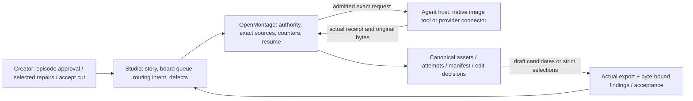
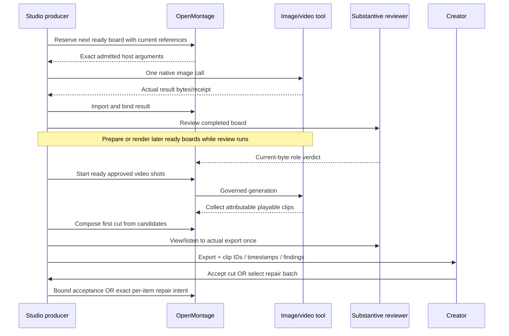
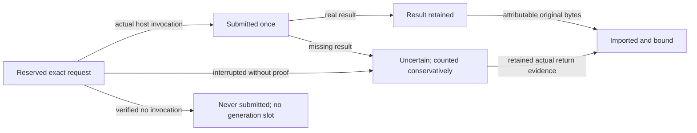
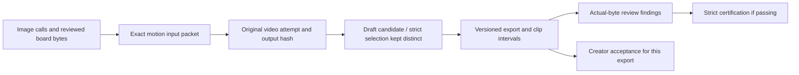
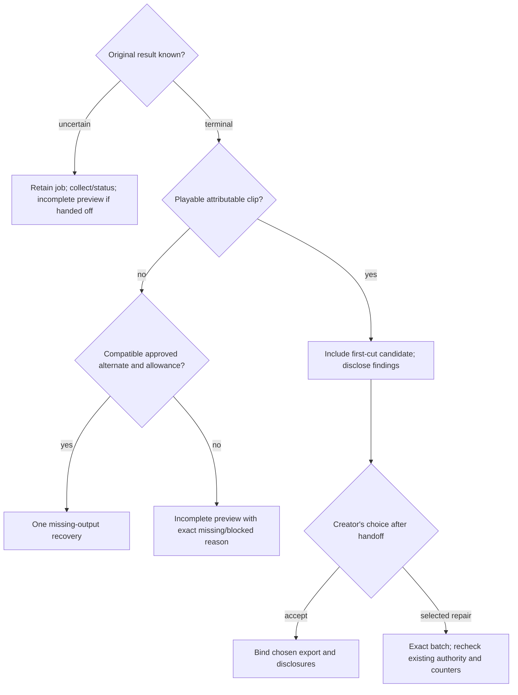

# Faster Boards and First Cut

## Goal Capsule

**Outcome:** the creator gets a complete playable first cut sooner, with a short, timestamped defect list, then decides which clips deserve more generation. Board preparation reuses valid references and overlaps preparation and review with rendering.

**Means:** one reusable image-call lifecycle (KTD1), a dependency-aware board queue (KTD2), separate draft and certification states (KTD3), and exact creator-selected repair batches (KTD4). Studio directs the story and experience; OpenMontage executes and accounts for authorized requests (KTD5).

**Authority:** this plan proposes software and workflow changes. It does not authorize media calls, uploads, purchases, publishing, new providers or additional episode allowances. Future production uses its own approved package and current engine support.

**Stop conditions:** an uncertain original request is reconciled before replacement; exhausted allowances or unsupported required native controls remain explicit blockers. Missing footage produces an honestly incomplete preview. Cosmetic defects do not stop a first cut.

**Execution and shipping:** code changes span the OpenMontage and Social Studio repositories. The implementing parent owns independent review, offline validation, PRs, integration into both main and development, and original local checkouts on development with existing work preserved. Active C78 and paused C77 are outside migration scope.

Paths below are repository-relative. “Studio” means the Social Studio repository; its identity-specific files are under `thisaccountisawarcrime/`.

---

## Product Contract

### Summary

Approve the episode package once, including routes, references, image allowance, video allowance and fallback scope. Prepare shared references and all board prompts, generate the necessary boards, and start reviewed independent shots as soon as their real inputs are ready. Use the first playable clip from each shot to assemble the first cut. Present that actual export and a compact defect list; the creator can accept it or name a repair batch.

### Problem Frame

Production currently mixes strict final selection with preview construction, making imperfect clips harder to assemble before repairs. Studio's repair helper only accepts critical semantic failures, although explicit creator-directed improvement can be minor. Its package helper and memory checker repeat parts of engine routing and accounting.

Board preparation also uses episode-local native-image bookkeeping. Repeated prompt preparation, serial coordination and duplicated review can lengthen the path to the first video request. Retained timestamps do not isolate native image duration, so no percentage speed improvement is established.

### Requirements

#### Board preparation

- R1. Reuse and prepare once. Build one shared cast/prop inventory and board prompt pack. Reuse exact valid bytes with current role and story applicability; regenerate only changed or missing assets. Reuse never consumes an image generation slot.
- R2. Schedule actual dependencies. Prepared start/end boards are the default motion inputs. Serialize only genuine dependencies: an image derived from another image, or a shot explicitly requiring actual outgoing video bytes. Prompt preparation and review can overlap subsequent rendering. A required native frame pin must be supported by the selected exact route.
- R3. Account for image calls. Native and supported fallback image calls share the approved episode image allowance, with exact reservation, submission, result/import and uncertainty records. Generation, failure and unresolved acceptance count once as applicable; read, review and collection do not. Image bookkeeping is separate from video-generation counters.
- R4. Focus board review. Use one persistent substantive reviewer. Minor aesthetic differences proceed with warnings; corrective image calls target essential cast, story or staging failures within existing image authority. Changed bytes require updated binding; unchanged bytes can reuse a valid observation when its applicability is established.

#### First cut and repair

- R5. First cut precedes creative repair. Once playable, attributable output exists for a shot, retain it for the first cut without automatic paid cosmetic or semantic replacement. Review findings remain visible. Draft inclusion does not make a failed candidate eligible as a strict selection or actual upstream continuity source.
- R6. Recover missing output within allowance. A confirmed terminal request with no usable video may use one already-approved compatible alternate within remaining allowance. Reconcile uncertain original acceptance first. Do not expand an exact model intent, route pool or billing scope. If recovery still produces no footage, identify the missing shot in an incomplete preview.
- R7. Preserve episode accounting. Two video generations per shot is the creator's configurable episode default. Status, collection and review consume no generation slots. Initial generation, fallback and later repairs share cumulative per-shot, total and repair limits; a successful fallback does not create a fresh repair allowance.
- R8. Show the actual cut and defects. Deliver one accessible export plus stable clip IDs and master timestamps. Each finding states what is wrong, its severity, whether listening/viewing was possible, and a proposed local edit or generation option. Preserve required source audio; do not add music or replace dialogue without the episode's authority.
- R9. Creator chooses repairs. One explicit batch may name several clips and per-clip models, including same-model improvements and mixed approved routes. Minor or passing-but-unwanted footage can be replaced under that exact intent without fabricating a critical failure. Generate only selected items, preserve old footage until a replacement is usable, and resume without duplicating submitted calls.
- R10. Acceptance is truthful and bound. “Use this cut” binds the creator's choice to the actual export and disclosed findings, closing pending creative repair intent for that cut. It does not erase QC failures or imply a certified pass or publishing permission. Later explicit repairs create a successor cut using remaining authority.

#### Ownership, cleanup and rollout

- R11. One owner for each rule. Studio owns creative judgment, episode defaults, board preparation, defect communication and creator commands. OpenMontage owns native capabilities, exact input/provenance checks, execution, counters, uncertainty, composition and certification. Studio helpers consume canonical engine decisions rather than maintain competing routing or accounting.
- R12. Measure and preserve. Retain simple stage timestamps and named blockers through existing artifact/event patterns. Attribute delays only when evidence supports it. Preserve historical records and WIP, and leave active productions unchanged unless separately migrated by explicit instruction.
- R13. Clean the current prompt path. Consolidate duplicated prompts, policy and template instructions into their existing owners. Keep mandatory entry points short and route to the material needed for the current task/stage. Retire proven superseded helpers only after callers move to the canonical path. Keep approved episode prompts, reusable cast/style knowledge, historical evidence and other identities intact; “old” alone is not a deletion criterion.

### Key Decisions

- KD1. Assemble before creative replacement. (session-settled: user-directed — chosen over immediate clip-by-clip regeneration: the creator wants to assess imperfections in the complete story before spending more.) Governs R5, R8–R10.
- KD2. Retry truly missing footage. (session-settled: user-directed — chosen over leaving every failed request missing: one approved alternate may recover a completely missing or errored result within the shot limit.) Governs R6–R7.
- KD3. Configurable episode defaults. (session-settled: user-directed — chosen over an engine-wide two-generation ceiling: the creator sets the episode policy and operational calls are not generations.) Governs R3, R7.
- KD4. Prepared frame pairs by default. (session-settled: user-approved — chosen over waiting for every prior video endpoint: existing images should enable independent shots unless actual outgoing bytes are required.) Governs R2, R5.
- KD5. Creator acceptance or selected repair batch. (session-settled: user-directed — chosen over autonomous perfection chasing: the creator can accept imperfections or name multiple clips and models at once.) Governs R9–R10.
- KD6. A dedicated prompt and legacy cleanup chunk. (session-settled: user-directed — chosen over only adding the new workflow: the creator also wants old prompts and older material cleaned up to reduce clutter and overhead.) Governs R11, R13.

### Acceptance Examples

| Example | Expected experience |
|---|---|
| AE1: Boards share an unchanged cast reference | Reference reused with applicable evidence; prompts prepared together; no replacement image call just to restate the same identity. A derived end board waits for its start-image bytes, not an unrelated video. |
| AE2: A clip has a minor visual defect | First cut uses that playable clip. Handoff identifies clip and timestamp. No automatic second generation. Creator may accept it or request a repair. |
| AE3: First generation returns no usable video | Collect/reconcile the original; after confirmed terminal failure, run one compatible approved alternate. With the default of two, zero slots remain for that shot afterward. |
| AE4: “Fix clips 2 and 5; use this model for 2 and the same model again for 5” | Resolve stable clip IDs against the current cut, preview the exact per-item changes and allowance, then execute the authorized batch. An unknown submitted request is collected, not submitted again. Failed replacement leaves original footage available. |
| AE5: “Cancel Grok; use this cut” | Restrict future Grok generation while retaining status/collection of already submitted work. Bind acceptance to this export and its warnings. Do not claim remote cancellation or a refund where the transport cannot provide it. |
| AE6: A shot has no footage | Provide an incomplete preview with the precise reason: recovery exhausted, original still pending, or actual-upstream input blocked by a defect. Retain pending requests/counters; no automatic creative repair or hidden still substitution. The creator can select the upstream repair, after which remaining dependent work resumes under its existing authority. |

### Scope and Boundaries

Included: reusable native-image bookkeeping; board preparation and review scheduling; governed first-cut assembly; current-export defect handoff; explicit repair/acceptance commands; canonical helper cleanup; a dedicated current-prompt/policy cleanup; offline regression coverage and measured stage events.

Considered and not built:

- Parallel native image generation: the current host tool exposes one prompt per call and no verified batch/concurrency guarantee. Preparation/review overlap still helps.
- Contact-sheet board generation, cropping substitutes, forced low resolution or a new image provider for speed: these change controls or creative quality and are unnecessary for this cleanup.
- A new OpenArt image adapter: rich connector image forms do not establish a canonical engine image route. Preserve currently supported routes; integrate another image provider only as separate work.
- Persistent cross-run validation caches or a monitoring subsystem: exact-byte reuse and small event records solve the demonstrated problem without those mechanisms.
- Automated repair scoring, new provider benchmarks or a “perfect one shot” guarantee: semantic judgment stays with the producer/reviewer.
- Looser strict certification or automatic posting of an accepted draft: creator choice and technical QC remain distinct.
- Automatic migration of C78, resumption of C77, new paid tests or replenished allowances.

### Sources and Current Baselines

- OpenMontage baseline: `fd866b33ebbfc815097e8baea731993efe352b38`; Studio baseline: `5e489a7e1b309dda12a94a8851183f83566438be`. Reconcile newer changes before implementation.
- OpenMontage: `lib/production_execution.py`, `lib/production_autonomy.py`, `lib/episode_production_controls.py`, `lib/production_draft.py`, `lib/production_request.py`, `lib/production_provenance.py`, `lib/production_review.py`, `lib/shot_contract.py`, `tools/video/video_compose.py`.
- OpenMontage: `skills/meta/shot-preparation-overlap.md`, `skills/creative/visual-development.md`, `schemas/artifacts/asset_manifest.schema.json`; image selector and Grok image transport tests.
- Studio: `scripts/plan_video_routes.py`, `scripts/preview_episode_package.py`, `scripts/check_memory.py`, `scripts/prepare_clip_review.py`, `scripts/validate_delivery.py` under the identity directory.
- Cleanup entry points: Studio root `AGENTS.md`; identity `AGENTS.md`, `START-HERE.md`, `AUTOPILOT.md`, consent, defaults and preparation/routing policies. Archived snapshots under identity `content/archive/system-before-consolidation-2026-09-16/` and `content/history/` already serve as history. OpenMontage's visual-development, video-prompting and prompt-audit skills are actively routed, not proven dead files.
- Retained C78 artifacts: `artifacts/shot_contract.json`, `artifacts/shot_preparation_plan.json`, `artifacts/native_image_generation_ledger.json`, and `notes/reserve_native_image.py` / `notes/import_native_image.py` within its project. All six shots list start/end roles, but S06-start is an actual-upstream placeholder, not a ready independent board. These records are evidence, not migration targets.
- C78 project creation to first motion request was about 82 minutes, spanning preparation and other unmeasured work; the retained motion request lasted about 85 seconds. Native-image durations are not retained. Neither interval establishes board-generation latency.

---

## Planning Contract

### Key Technical Decisions

- KTD1. A canonical image-call artifact, not episode-local ledgers. Add `lib/production_images.py` and a closed image-call schema. Build a pre-board source packet from approved story, current reference bytes and explicit unresolved board slots; the existing reviewed-motion packet cannot bootstrap its own missing boards. Reserve before the agent invokes the real host image tool, then record/import attributable results. Use local call IDs honestly; native image generation exposes no provider status/resume API. Share image accounting across supported native and Grok fallback paths. Governs R1, R3, R11.
- KTD2. Separate static-image and motion dependencies. Studio prepares the prompt pack and schedules ready image nodes; OpenMontage validates exact current sources at reservation and dispatch. Preserve end-from-start image dependencies and declared actual-outgoing-video dependencies. Reuse immutable preparation results, but rehash bytes at dispatch. One substantive reviewer works alongside later ready rendering; the parent checks bindings and resolves disputes rather than repeats the review. Governs R1–R4, R12.
- KTD3. Candidate inclusion is distinct from strict selection. Reuse canonical manifest/edit metadata and production attempt provenance to bind draft candidates. First-cut composition can run as a preview while asset review remains open; do not falsely complete the assets checkpoint. Existing strict selection, actual upstream eligibility and certification stay intact. Record creator acceptance separately against the export hash and findings. (session-settled: user-directed — chosen over marking failed footage as passing: complete-cut review must preserve honest defects.) Governs R5, R8, R10; implements KD1/KD5.
- KTD4. Exact per-item creator repair intent. Extend the canonical repair boundary for explicit human-requested batches, independently of critical-defect auto-repair derivation. Bind each item to current cut, source attempt, exact approved route and stated changes. Same-model exceptions are scoped to that item, leaving the episode's alternate policy intact. Persist planned/submitted/uncertain/completed/failed item states; never reset cumulative counters. (session-settled: user-directed — chosen over changing global alternate policy or inventing critical severity: selective repair should follow the creator's actual instruction.) Governs R7, R9–R10; implements KD3/KD5.
- KTD5. Thin Studio adapters and one policy owner. Engine returns capability, authority, counters, route eligibility and operation results. Studio resolves creative commands and maintains the board queue and export findings. Reuse existing `production_entry.py`, planner and status interfaces. Remove divergent helper predicates/defaults; do not introduce a UI framework or competing video ledger. Governs R6–R13.
- KTD6. Instrument existing boundaries. Add packet-ready, reservation/submission, tool-return/import, review start/end, promotion, first-video and export events where genuinely observed. Report provider time separately from preparation, review, engine work and editing only when paired timestamps exist. Unknown stays unknown. Governs R12.
- KTD7. Slim entry points, preserve evidence. Use existing guides and owner docs rather than add another full workflow prompt. Bring reusable lessons into those owners with source references; consult raw historical prompts and learning entries only when relevant. Before moving/removing a prompt or helper, trace boot links, director/registry routing, imports, CLI entry points and tests. There is no demonstrated unused OpenMontage skill to delete from the current audit. Governs R11, R13; implements KD6.

### Assumptions and Execution Unknowns

- Recommended board behavior for approval: reuse valid cast/props, prepare prompts once, review with one persistent reviewer, and correct only essential board failures. No new arbitrary two-image limit; use the approved episode image allowance.
- This first-cut behavior is an episode mode, not a forced change to every OpenMontage pipeline. Existing strict workflows remain available.
- No new provider contract is assumed. Native host calls remain agent-executed; terminal Python cannot impersonate the host tool or invoke MCP by itself.
- Prefer existing artifact metadata for draft and batch bindings. Add a small schema only where current fields cannot express the invariant; decide exact field names during implementation.
- There is no unresolved launch-blocking product choice. Performance percentages and parallel native generation remain unproven and are excluded, not prerequisites.

### High-Level Technical Design

#### Responsibilities and Data Flow



#### Production and Repair Sequence



The native image invocation above is performed by the agent host, not an engine subprocess. Video connector invocation similarly uses its existing governed host adapter.

#### Output State and Mode Boundaries

```mermaid
stateDiagram-v2
    [*] --> Preparing
    Preparing --> Generating: ready reviewed inputs
    Generating --> Reconciling: acceptance/result uncertain
    Reconciling --> Generating: original resolved; eligible missing-output fallback
    Generating --> FirstCut: all planned shots have playable candidates
    Generating --> IncompletePreview: no footage or failed actual-upstream dependency
    Reconciling --> IncompletePreview: original pending; keep it open and counted
    FirstCut --> Reviewing
    Reviewing --> Delivered: actual export + honest findings
    Delivered --> CreatorAccepted: exact export chosen with disclosures
    Delivered --> RepairBatch: explicit selected items within authority
    RepairBatch --> FirstCut: successor cut; prior bytes/history retained
    Delivered --> Certified: strict current-byte review passes
```

Creator acceptance and certification are independent dispositions; a successor invalidates old acceptance for the new bytes, not the history. A preview handoff does not cancel pending jobs or force a paid upstream repair. Continue unrelated ready work and identify the exact blocked or pending shot.

| Mode or event | Can generate? | Can collect/status? | Meaning |
|---|---|---|---|
| First cut, playable imperfect clip | No automatic creative replacement | Yes | Retain candidate and disclose defect. |
| Confirmed terminal no usable clip | One compatible approved alternate within allowance | Yes | Existing missing-output fallback authority. |
| Uncertain submitted job | No replacement for that shot | Yes | Resolve actual original first. |
| Failed actual-upstream dependency | No automatic creative repair | Yes | Incomplete preview names the blocked dependent shot and upstream remedy. |
| Explicit selected repair batch | Only its items under current authority | Yes | Per-item same/different model intent; existing counters. |
| Creator accepts cut | No pending creative repair for that cut | Yes | Chosen export, QC unchanged. |
| “Cancel Grok” | No new Grok dispatch | Yes, for existing jobs | Prospective restriction; remote cancellation only if supported. |

#### Native Image Call Lifecycle



An actual terminal tool error remains a failed call in history. Neither uncertainty nor a local call ID supplies a native provider query or a retry entitlement.

#### Current-Byte Records



Acceptance and certification can coexist for the same export. Neither changes the original attempt, findings or cumulative counts.

#### Clip Decision



### Sequence and Risks

Land engine primitives and offline coverage first, then Studio adapters and policy cleanup. Avoid simultaneous edits to both implementations of a rule. The main correctness risks are duplicate host submission, accepting unbound result bytes, conflating draft inclusion with upstream eligibility, and globally granting a same-route repair exception. Each has a specific regression case below.

The main speed risk is moving waits without removing their cause. Use observed readiness and timing events; do not promise native parallelism or infer provider delay from gaps in conversation.

---

## Implementation Units

### U1. Canonical board-image lifecycle

**Goal:** replace new-episode native-image bookkeeping with a reusable admitted call/import path.  
**Requirements:** R1, R3, R11–R12; KTD1, KTD6.  
**Dependencies:** none.

**Files:** OpenMontage `lib/production_images.py` (new), an image-call artifact schema under `schemas/artifacts/`, bounded request/execution and registry integration, `tests/lib/test_production_images.py` (new), `tests/lib/test_production_request.py`, `tests/tools/test_grok_cli_image_session.py`.

**Approach:** implement a pre-board packet distinct from reviewed-motion packets; atomic image admission and canonical status; actual-return import with ordered references and current hashes. Expose host arguments, not a fake builtin renderer. Share image accounting with supported fallback routes and retain uncertainty when no actual result evidence exists.

**Test scenarios:**

- Reuse of current reference bytes consumes no generation; changed references invalidate prepared bindings.
- Competing reservations cannot exceed the approved image allowance.
- Native submission/import records once, with real bytes and no invented provider ID.
- Failure and uncertain acceptance survive resume; collection/status are free; no blind duplicate invocation.
- Grok fallback consumes the same image allowance and requires its existing provider/session authority.
- Reviewed-motion preparation still rejects missing or unreviewed boards; the pre-board path does not waive motion checks.

**Verification:** focused image/request tests; schema round-trip and a mocked host lifecycle. No paid image test.

### U2. Studio board preparation and ready-work scheduling

**Goal:** shorten the board critical path while retaining story/cast checks.  
**Requirements:** R1–R4, R12; KTD2, KTD5–KTD6.  
**Dependencies:** U1.

**Files:** Studio `scripts/production_entry.py`, one bounded board-preparation helper if needed, `content/policies/shot-preparation.md`, `content/policies/production-speed.md`, `content/templates/shot-preparation-plan.json`, `scripts/test_shot_preparation.py`, `scripts/test_workflow_contracts.py`. OpenMontage `skills/meta/shot-preparation-overlap.md`, `skills/creative/visual-development.md`, `tests/integration/test_shot_preparation_overlap.py`.

**Approach:** construct shared inventory and text prompt pack once; distinguish unresolved asset slots from ready exact-byte packets. Prioritize shared cast and payoff boards that unblock multiple shots. Schedule static image dependencies separately from video dependencies. Reuse one reviewer and transfer one observation into project/delivery records. Start ready independent video work under existing approved overlap authority.

**Test scenarios:**

- End-from-start image dependency waits for start-image bytes; unrelated text prompts prepare immediately.
- Actual outgoing-video dependency stays serialized; prepared frame pairs have no invented predecessor wait.
- Reused cast image receives applicable role evidence without a duplicate image call.
- Minor aesthetic finding continues; critical cast/staging finding permits only targeted correction within image authority.
- Changed board promotion stales affected bindings; unchanged valid roles are carried correctly.
- Image tooling without native batching never emits an invented batch/concurrency argument.

**Verification:** board scheduling fixtures and existing overlap integration tests; count calls/reviews in a synthetic episode, without timing claims.

### U3. Engine first-cut candidates, preview and acceptance

**Goal:** compose truthful previews from actual playable clips before creative replacements.  
**Requirements:** R5, R8, R10–R11; KTD3.  
**Dependencies:** none; integrated exercise follows U2.

**Files:** OpenMontage `lib/production_draft.py`, `lib/production_execution.py`, `lib/production_review.py`, `tools/video/video_compose.py`, manifest/edit metadata schemas as needed, `tests/lib/test_creator_draft_exception.py`, `tests/lib/test_episode_status_transitions.py`, `tests/lib/test_production_review_successors.py`, `tests/integration/test_first_pass_workflow.py`.

**Approach:** bind candidates through existing attempt-result/provenance loaders. Add explicit first-cut inclusion and export-bound acceptance, separate from strict selected attempts and certification. Preview uses canonical composition without completing open asset checkpoints. Preserve source audio and previous export versions.

**Test scenarios:**

- Playable candidate with a failed semantic predicate composes with truthful findings; strict selection/certification still reject it.
- Complete first cut requires real clip coverage for every planned shot; missing coverage yields an incomplete preview.
- Failed or unreviewed candidate cannot satisfy a strict actual-outgoing dependency; the dependent shot appears as blocked in an incomplete preview, without an automatic upstream repair.
- Source video audio survives composition; external audio cannot silently replace approved dialogue.
- Export/source hash change makes acceptance and review stale for successor bytes.
- A draft render failure retains diagnosable artifacts and never reports a completed cut.

**Verification:** focused draft/state/provenance tests and tiny local media composition fixtures.

### U4. Governed fallback and exact creator-selected repair batches

**Goal:** apply the creator's selected repairs without automatic perfection loops or duplicate calls.  
**Requirements:** R6–R7, R9–R11; KTD4–KTD5.  
**Dependencies:** U3.

**Files:** OpenMontage `lib/episode_production_controls.py`, `lib/production_autonomy.py`, `lib/production_execution.py`, `lib/video_model_selection.py`, repair/batch artifact definitions as needed; `tests/lib/test_episode_production_controls.py`, `tests/lib/test_production_autonomy.py`, bounded batch regression tests.

**Approach:** reuse missing-output `access_fallback` after terminal reconciliation. First-cut mode defers creative automatic repairs. Add exact creator batch intent to the existing governed repair boundary, with item-scoped same-model exceptions and cumulative accounting. Resolve duplicate commands by retained batch/item identity; failed replacements retain originals.

**Test scenarios:**

- Default two permits initial generation and one missing-output fallback, then zero extra repair slots.
- Configured three permits a third call only when all per-shot/total/repair authority allows it.
- Pending/uncertain original prevents replacement, but status/collect remain available.
- A selected upstream repair resumes only its affected pending dependencies; unaffected footage and counters remain intact.
- Explicit minor or passing-but-unwanted repair works without altering review severity.
- Mixed batch permits authorized same-model and alternate items without changing global alternate policy.
- Interrupted batch resumes only unsubmitted authorized items; completed/submitted identities never dispatch twice.
- “Cancel Grok” blocks subsequent Grok generation, allows collection, and grants no new substitute authority.

**Verification:** canonical controls/autonomy regressions, mocked provider receipts and partial-batch replay.

### U5. Studio cut handoff and creator commands

**Goal:** make the complete cut and selective repair decisions easy to use.  
**Requirements:** R7–R11; KTD3–KTD5.  
**Dependencies:** U3–U4.

**Files:** Studio `scripts/production_entry.py`, `scripts/plan_video_routes.py`, `scripts/preview_episode_package.py`, `scripts/prepare_clip_review.py`, `scripts/validate_delivery.py`, `scripts/check_memory.py`; corresponding existing tests plus one focused first-cut/repair-command test module.

**Approach:** hand off export, stable clip numbers/IDs, master intervals and a short defect sidecar using existing review evidence. Translate accept/repair/cancel commands into canonical operations. Package preview reads effective controls and canonical alternate eligibility, eliminating its mode-only alternate mismatch and hardcoded default. Memory/status uses engine accounting, including proven never-submitted calls.

**Test scenarios:**

- Defect timestamps point into the actual export and map back to the correct attempt/source.
- Acceptance is visibly distinct from a QC pass and does not claim posting occurred.
- One multi-clip command resolves selected current items; stale export or ambiguous clip ID requests only the missing clarification.
- Preview respects configured per-shot limits alongside unchanged total/image caps.
- A mode-only change is not advertised as a provider/media-model alternate.
- Memory and production status agree on rejected-before-submission, failed, uncertain and collected requests.
- Listening unavailable remains disclosed; transcript or a silent contact sheet does not claim audio review.

**Verification:** planner/package/status/review tests and CLI-facing mocked episode flows. No separate Studio dispatch implementation.

### U6. Dedicated prompt, policy and obsolete-helper cleanup

**Goal:** give future production a shorter, coherent reading path and remove superseded instructions.  
**Requirements:** R11–R13; KTD5, KTD7.  
**Dependencies:** U1–U5 establish the replacement behavior before old paths retire.

**Files:** OpenMontage `AGENT_GUIDE.md`, owning production/selection docs, `skills/meta/shot-preparation-overlap.md` and relevant stage directors. Studio root `AGENTS.md`; identity `AGENTS.md`, `START-HERE.md`, `AUTOPILOT.md`, `GENERATION-CONSENT.md`, `SEMANTIC-QC.md`, `video-production-defaults.md`, `content/policies/shot-preparation.md`, `content/policies/production-speed.md`, `content/policies/video-model-routing.md`, `content/policies/end-to-end-production.json`, `content/templates/video-brief.md` and `content/drafts/beat-sheet-template.md`; workflow-contract tests in both repositories.

**Approach:** inventory each active entry point and assign one owner per rule. Consent owns exposure/authority; canonical controls own counters; QC owns evidence and certification; preparation owns image/DAG rules; delivery defaults own export/handoff. Retain compact entry-point routing and ordered workflow, replacing repeated detailed policies with pointers. Remove stale required Grok, music, continuation hooks, serialized shots or multiple masters where the episode's actual choices govern them. Make an episode's current brief/prompt pack the production input rather than copying earlier episode prompts wholesale.

Keep historical prompt snapshots and approval evidence where they are; exclude them from automatic current-policy loading. Fold relevant durable lessons into existing owners with references rather than routinely loading every raw learning entry. Preserve useful prompting vocabulary and provider skills. Only delete an obsolete tracked helper/prompt after its replacement works and no active entry point, import, CLI or test uses it; no blanket age-based purge. Other identities keep their own defaults and voice.

**Test scenarios:**

- Each consent, accounting, review, preparation and delivery rule resolves to one owner from all current entry points.
- New-video and resume paths load applicable current material, not archived episode prompts; relevant historical evidence remains reachable on demand.
- Templates preserve required cast/story/action fields without forcing a provider, music, continuation story or duplicate exports.
- Replacement helper is exercised before its superseded path retires; imports, CLI entry points and links have no broken references.
- Reusable cast/style/provider prompt knowledge, historical approvals and C78/C77 media remain unchanged; shared-guide edits do not apply identity rules to another brand.

**Verification:** workflow-contract checks, reference/import/CLI audit and before/after inventory of routine-read bytes or tokens when measurable. Report actual removals, consolidations and preserved material; do not claim arbitrary prompt deletion as a speed gain.

### U7. Stage evidence, integrated proof and shipping

**Goal:** verify the streamlined path and provide a concise measured receipt.  
**Requirements:** R1–R13; KTD1–KTD7.  
**Dependencies:** U1–U6.

**Files:** bounded event integration in OpenMontage `lib/production_images.py`, `lib/production_execution.py`, `lib/production_draft.py` and `tools/video/video_compose.py`; Studio board/review/delivery adapters; relevant first-pass, overlap and workflow-contract tests.

**Approach:** reuse existing timestamps and add only missing stage boundaries. Connect image/import/review, first video and actual export events to the same episode receipt. Exercise the complete flow offline, review substantive source independently, and ship both repositories without moving live production onto the new mode.

**Test scenarios:**

- Mock episode goes board reuse → ready independent shots → playable imperfect cut → actual-export findings → selected mixed repair → successor acceptance.
- Terminal missing output exercises approved fallback; uncertain output, failed upstream and exhausted allowance produce precise incomplete-preview states.
- Existing strict pipeline and current C78 artifacts remain unchanged and valid under their current mode.
- Paired events separate measured provider time from preparation/review/editing; missing timestamps remain unknown.

**Verification:** full relevant suites, fresh substantive source review, diff/WIP audit and cross-repository integration receipt. PRs target both branch destinations after implementation approval. The next separately authorized video supplies live acceptance evidence.

---

## Verification Contract

1. **Establish current baseline before edits.** Check current branches and retained production records, run relevant existing suites and record pre-existing failures separately. The baselines above are historical source anchors, not permission to reset newer work.
2. **Verify changed boundaries with offline evidence.** Use OpenMontage's focused `tests/lib/`, `tests/tools/` and integration targets named in U1–U4; Studio's `scripts/test_*.py` suite with its documented OpenMontage linkage. Tests must exercise real canonical functions, not just mirror helper formatting.
3. **Compose tiny local media.** Verify clip ordering, intervals, coverage, preserved source audio and stale byte bindings using short deterministic fixtures. Listening to synthetic fixtures can prove the software path; it cannot certify generated dialogue quality.
4. **Review independently.** A fresh reviewer checks the brief, substantive diffs and actual check results. Resolve consequential findings before merge; the implementer is not their sole reviewer.
5. **Observe the next separately authorized episode.** Reuse the creator's production run as the live acceptance test; do not start a benchmark or competing run. Retain stage timings, actual calls, reuse counts, review observations and first-cut/repair outcomes. Do not assert production-path success from passing tests alone.

Pass criteria: no automatic creative replacement before first-cut delivery; no duplicate host/provider submission on resume; no counter reset or expanded authority; no failed candidate promoted to strict continuity/certification; correct current-export findings/acceptance; shared board reuse and ready-work scheduling exercised.

---

## Definition of Done

- U1–U7 are implemented with the requirement/test traces above and independent review completed.
- New episodes use canonical image bookkeeping and engine-derived accounting; no competing native ledger or divergent Studio alternate rule remains in the new path.
- Board prompts/reference reuse and one substantive reviewer reduce avoidable coordination. Ready work proceeds without unrelated dependencies; essential story/cast checks remain.
- The creator receives an actual first cut, disclosed defects and a simple accept-or-selected-repair experience. Missing footage, uncertain jobs, unavailable audio review and exhausted allowances are reported honestly.
- Superseded helper paths and contradictory prompt/policy/template rules are removed or consolidated into their owners. Routine loading uses a shorter current path; archival evidence and reusable knowledge remain available.
- PRs are merged into main and development in both repositories; original local checkouts are on development with unrelated WIP and production bytes preserved.
- Active C78, paused C77, historical approvals and counters are unchanged. No generation, upload, purchase or publication occurs merely to complete this software work.
- Software validation and live acceptance evidence are reported separately. The next authorized episode gets a concise measured receipt, without an invented speed or quality guarantee.
