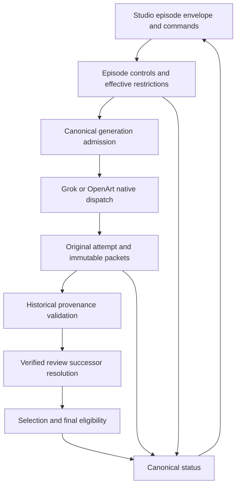
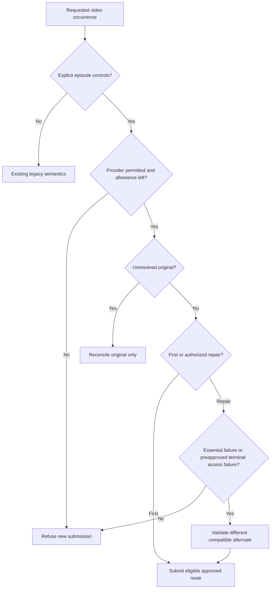
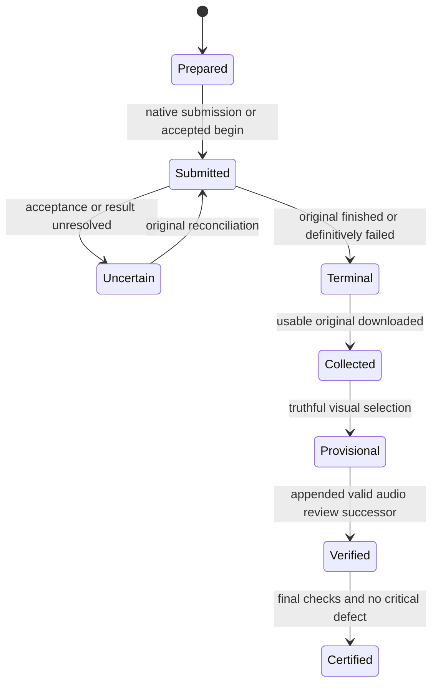

# Episode Production Controls - Plan

**Target repositories:** OpenMontage and social-studio-episode-controls. Engine paths below are relative to OpenMontage; Studio paths are relative to social-studio-episode-controls.

## Goal Capsule

- **Objective:** Creators can finish governed episodes without repeated same-route rerolls, duplicate reviews or losing usable footage when they change provider permission.
- **Means:** Episode-scoped generation controls, verified review successors and Studio commands using canonical engine entry points (KTD1–KTD5).
- **Authority:** Latest explicit creator instruction, retained approved episode envelope, then canonical scope/request/account checks. The configurable episode default supersedes wording in the prior plan that could imply a permanent engine-wide cap.
- **Execution profile:** Offline software implementation and verification only; C77 production/media remains untouched and its monitor remains paused.
- **Stop conditions:** Do not submit media, upload assets, query provider accounts, purchase credits or activate a new production. Report any inability to preserve historical authority or native controls as an implementation blocker.
- **Shipping:** Root owns reconciliation, independent acceptance, PRs, merging main/development and restoring original checkouts to development while preserving unrelated WIP.

---

## Product Contract

### Summary

Studio records a practical episode envelope and invokes engine controls through supported commands.
The engine enforces declared generation limits and route restrictions, retains original job recovery and permits verified audio review upgrades of unchanged footage.
Usable clips with minor imperfections continue with disclosed warnings.

### Problem Frame

C77 retained a Grok-only execution plan despite mixed-provider intent, then made two same-route staging repairs after a genuine story failure.
Late integration defects and repeated review handoffs delayed continuation.
Current immutable upstream review hashes also prevent later audio evidence from certifying already generated dependent footage.
Revoking an active policy can invalidate historical derived-attempt authority rather than merely stopping future calls.

### Key Decisions

- **Configurable episode default, not global clamp.** Governs R1, R2. (session-settled: user-directed — chosen over a permanent engine-wide two-call limit: episodes may explicitly choose another allowance.)
- **Keep minor imperfections when the joke/dialogue work.** Governs R3, R4. (session-settled: user-directed — chosen over cosmetic rerolls: usable output should proceed with honest warnings.)
- **Preserve existing footage and original-job recovery.** Governs R5–R8. (session-settled: user-approved — chosen over regeneration or rewritten historical authority: reviewed bytes and paid originals remain reusable.)

### Requirements

**Episode permission and routing**

- R1. Studio defaults each newly activated episode to two video generations per shot, with an explicit configurable value retained in its approval; engine enforcement uses that value and never silently clamps all episodes to two.
- R2. Opted-in episodes count submitted/accepted/terminal/uncertain video generations once across all scopes; reviews, status checks, collection and downloading consume zero generation slots, and exclusion requires canonical positive proof of no submission or unresolved acceptance.
- R3. After a reconciled result fails a named essential story predicate, a generation repair must use an eligible approved different provider or reported media model when alternate repair is declared; prompt, agent-model and same-model mode changes do not establish difference.
- R4. Minor details that leave essentials usable become disclosed warnings, while actual critical failures and unknown audiovisual evidence retain their truthful status; neither cosmetics nor unknown AV triggers a new generation.
- R5. The initial envelope may separately permit bounded access fallback after confirmed terminal provider failure with no usable result; it uses the approved different alternate and remaining shared allowance, never uncertain-job or collection-error inference.
- R6. An explicit prospective provider restriction blocks new submissions through old strict scopes, derived scopes, local continuations and connector begin, preserving already submitted job reconciliation and all historical footage authority.

**Review and delivery**

- R7. Verified audio/AV evidence may advance an unchanged provisional selection through an append-only review successor without new media generation or rewriting frozen requests, source packets, preparation bindings or prior reviews.
- R8. A review successor cannot erase visual failure, change selected bytes/planning subject or convert an accepted critical draft defect into a clean pass.
- R9. Studio uses one persistent producer and one substantive reviewer, reuses their bound evidence across required reports and derives current progress from canonical records rather than manual competing counters.

**Compatibility and operations**

- R10. Missing episode controls retain existing legacy semantics; opt-in or later authorized amendments preserve cumulative history and cannot reset old spent allowances.
- R11. Studio can activate controls, restrict a provider, record a verified review successor and inspect canonical status through usable entry functions/commands, with no custom provider runner.
- R12. No change silently relaxes native pins, exact intent, story identity, account/billing permission or job-recovery rules; planner output grants no authority.

### Scope Boundaries

No live C77 transition, new footage/audio review, provider benchmark, media generation, upload, purchase, subscription cancellation or submitted-job cancellation is included.
“Cancel Grok” in episode production means prospective generation restriction unless the creator explicitly requests something broader.
No broad orchestration framework, automatic quality judgment, paid qualification gate or new monitoring service is built.
Independent later-board preparation remains optional under existing dependency rules.
Provider refunds and cancellation APIs are not inferred from terminal status names.

### Acceptance Examples

- AE1. Covers R1, R2, R10. A legacy episode retains old accounting; a new approved limit of three permits three accountable generations rather than a hidden global two-call clamp.
- AE2. Covers R3–R5. An episode with the default two calls admits one eligible alternate after genuine essential failure; a minor visual warning uses no additional call, and a terminal no-output access fallback requires its distinct preapproval.
- AE3. Covers R6, R12. After prospective Grok restriction, an old queued Grok scope cannot submit; a previously completed Grok selection still validates, and a pending original can still be reconciled/collected.
- AE4. Covers R7, R8. A provisional Grok-to-MCP-to-Grok chain becomes review-eligible after actual verified audio evidence without changing any original packet or output hash; its accepted critical defect remains draft-only.
- AE5. Covers R9, R11. Studio’s status command agrees with journals, selections and effective permissions without submitting a provider request or consuming allowance.

Product Contract preservation: approved scope retained; the creator's latest configurable-default correction governs R1/R10 and supersedes permanent-cap interpretations.

---

## Planning Contract

### Key Technical Decisions

- KTD1. **One opt-in episode-control artifact.** Add `lib/episode_production_controls.py` and `schemas/artifacts/episode_production_controls.schema.json`. Retain creator evidence, project/story, numeric per-shot limit, alternate-repair setting and optional access-fallback permission; expose effective settings without changing legacy defaults (R1, R5, R10). Keep this independent of creative judgment and provider transports.
- KTD2. **Separate prospective admission from historical approval.** Store evidence-bound provider restrictions as append-only episode control amendments. Dispatch resolves effective restrictions; provenance reads original immutable approval independently of current generation permission (R6, R10). Current `production_autonomy.validate_policy_attempt` requires an active policy, so its historical loader must be corrected rather than deleting old scopes.
- KTD3. **Derive generation counts from trusted occurrences.** The controls module normalizes attempt journals/outbox/native receipts into one count per original occurrence plus uncertainty reasons (R2). A local `not_dispatched` label alone is insufficient. Local continuation that later submits becomes counted; collection/status actions never do. Keep legacy `attempt_counts` behavior on non-opted-in episodes.
- KTD4. **Resolve review successors without mutating generation subjects.** Add `lib/production_review_successors.py` with append-only, evidence-bound old/new review links. Resolve current review for selection/final checks while validating historical dispatch against frozen review/contract/source/preparation packets (R7, R8). Current `selection_digest` already excludes the review and supplies the stable unchanged-media subject.
- KTD5. **Studio calls shared engine APIs.** Extend existing `thisaccountisawarcrime/scripts/production_entry.py` for user-facing controls, provider restriction, review upgrade and status (R11). Studio’s quality/route authoring belongs in its existing policies and planner; the engine receives declarations and evidence, not taste rules.

### Interface Contract

Names are proposed public entry-point names; workers may rename them only with coordinated U1/U2/U3 agreement. No provider calls occur in these entries except existing explicitly authorized generation dispatch, which remains separate.

| Owner | Entry | Input and observable result |
|---|---|---|
| U1 | `record_episode_controls` | Project root, approved controls and retained creator evidence; validates schema/identity/limits and writes an immutable approval record plus current binding under project lock. No activation inferred from configuration alone. |
| U1 | `restrict_episode_provider` | Project root, exact provider or declared provider set, creator evidence and reason; appends prospective restriction, returns affected unsubmitted scope/attempt IDs and effective permission. Never mutates completed attempts or claims remote cancellation. |
| U1 | `generation_admission` | Project, canonical route/request/scope, occurrence and purpose; returns effective limit/count/route eligibility or a concrete refusal. Shared by strict dispatch, derived policy dispatch, local continuation and MCP begin. |
| U1 | `generation_usage` | Canonical project journals/receipts; returns total/per-shot submitted or uncertain counts, excluded never-submitted evidence and unresolved original IDs. Read-only. |
| U1 | `load_historical_policy` | Original scope/policy binding and retained approval evidence; returns validated original policy for provenance without requiring current admission permission. Does not authorize dispatch. |
| U2 | `record_review_successor` | Exact selection, old/new review and actual evidence; validates monotonic audio advancement and appends successor. Returns resolved review identity and subject, without provider activity. |
| U2 | `resolve_review_successor` | Historical review hash, exact selection subject and evidence history; returns latest unique valid successor or rejects stale/conflicting evidence. Read-only. |
| U1/U2 | `episode_production_status` | Canonical project; returns selections, warnings, critical/unknown review state, pending originals, generation usage, effective controls/provider restrictions and delivery eligibility. U1 owns export; U2 supplies review resolution. |

Historical policy loading and review successor resolution must not cross into generation admission.
Provider removal targets declared canonical route providers; do not silently equate `openart_mcp` and `openart_cli` accounts or transfer permission between them.

### High-Level Technical Design

Control revocation changes future admission, not these historical states.
An MCP begin handed to the agent is conservatively consumed/uncertain; after handoff, do not promise remote cancellation or zero submission without canonical reconciliation.

### Ownership and Sequencing

U1 and U2 may proceed in parallel after agreeing the interface contract; each worker owns disjoint existing files.
U3 can author Studio policy while engine entry names stabilize, then integrate those entries before its acceptance tests.
U1 owns `production_execution.py` integration calls requested by U2; U2 must send the required hook contract rather than edit that file.
U2 owns `production_provenance.py`; U1 supplies the historical-policy loader for its use there.
Root owns final cross-repository replay, documentation integration, PRs and shipping.

### Risks and Deferred Implementation Details

- The historical MCP validator currently rebuilds a packet from current selection reviews. It must validate the frozen original packet against immutable original authority and separately resolve review successors; ignoring hashes is not an acceptable shortcut.
- Admission restrictions must be rechecked at the existing locked preflight and MCP begin, including local continuations capable of new submission. Already handed-off/submitted work remains an original-job reconciliation problem.
- Creator evidence retention should reuse existing evidence/digest patterns. Exact artifact placement and schema field names remain worker implementation details within KTD1–KTD4.
- The original Studio checkout contains 33 unrelated WIP changes, including overlapping policy/entry/tests. Implement in the isolated Studio repository and preserve those changes during root shipping.
- No blocking product choice remains. Offline failures may expose implementation refinements, but must not silently alter R1–R12.

### Sources and Existing Patterns

Retained audit requirements: `c77-postmortem-and-fix-plan.md`, `c77-routing-and-overhead-audit.json`, `c77-plan-independent-review.json` and the latest creator correction supplied by root. These external audit identities are requirements evidence, not copied production records.

Engine baseline is `52d6c51d8afa128dcfebcb43690a9ff9b23be4b9`.
Follow `lib/production_execution.py` strict preflight and project-lock replay, `lib/production_autonomy.py` rooted approval/scope/cap handling, `lib/openart_mcp_jobs.py` durable consumed-before-handoff state, `lib/shot_contract.py` selection/review digests and `lib/production_review.py` final scene bindings.
Existing tests include `tests/lib/test_production_execution.py`, `tests/lib/test_production_autonomy.py`, `tests/lib/test_draft_audio_review.py`, `tests/lib/test_mcp_autonomy.py` and `tests/lib/test_openart_mcp_jobs.py`.
No external provider research is needed: this work changes local governance and review transitions, not provider capability claims.

---

## Implementation Units

### U1. Canonical configurable episode controls and generation admission

**Owner:** Engine execution worker. Not alone in the codebase; preserve U2/U3/root edits.

**Goal:** Make declared episode settings executable across canonical dispatch and preserve historical approvals after prospective restrictions.

**Requirements:** R1–R6, R10–R12; KTD1–KTD3.

**Dependencies:** None; agree public hook inputs/results with U2 and U3 before interface changes.

**Files:** `lib/production_autonomy.py`, `lib/production_execution.py`, `lib/video_model_selection.py`, `lib/openart_mcp_jobs.py`; new `lib/episode_production_controls.py`, `schemas/artifacts/episode_production_controls.schema.json`, `tests/lib/test_episode_production_controls.py`; focused additions in `tests/lib/test_production_autonomy.py`, `tests/lib/test_production_execution.py`, `tests/lib/test_openart_mcp_jobs.py`. Any additional schema/test file needs root ownership coordination.

**Approach:**

1. Add KTD1 persistence/read APIs and KTD3 accounting, preserving legacy behavior without opt-in.
2. Integrate admission at strict/derived dispatch, local continuation and MCP begin under existing locking/replay boundaries.
3. Extend repair route identity to different provider or actually reported media model, including model-null Grok in both directions; retain exact intent and unchanged native request checks.
4. Implement prospective restrictions without modifying historical scopes/authority. Supply `load_historical_policy` for U2 and remove active-admission dependencies from historical authority loading owned here.
5. Export the engine status entry using U2 review resolution and existing journal readers, without creating another manually maintained counter.

**Patterns:** Rooted retained evidence, exact scope/request digests, `_scope_material`, `validate_derived_scope`, locked `preflight`, `openart_mcp_jobs.begin` and cumulative lineage accounting.

**Execution note:** Characterize current legacy and mixed-provider original recovery before changing admission/accounting.

**Test scenarios:**

1. Covers AE1. No controls retains legacy limits; explicit limits one, two and three enforce their own retained values, with no global two clamp.
2. Repeated review/status/download/collection consumes zero new slots; terminal failure and unresolved submission each count once.
3. Proven no-submit preparation is excluded; unproven wrapper exception or unresolved outbox counts conservatively and blocks duplication; later continuation submission adds one count for that original.
4. Covers AE2. Actual essential failure admits Grok-to-OpenArt and OpenArt-to-managed-Grok once; same prompt route, mode-only change and Grok agent-model relabel fail alternate identity.
5. Minor warning or unknown AV cannot authorize generation repair; existing critical verdicts are not rewritten.
6. Preapproved terminal no-output access fallback shares the same cap; uncertain/collection failures reconcile, and no third call appears after slot two.
7. Covers AE3. Restriction rejects old strict/derived/queued Grok scopes and local new-submit continuation, plus MCP begin when that provider is restricted; original status/collection and completed historical authority remain valid.
8. New restrictions/controls with wrong project/story, changed evidence or unauthorized route/account reject; failed amendment cannot partially apply.
9. Cumulative counts survive new scopes/control amendments; opted-in limits never erase legacy spent occurrences.
10. Covers AE5. Status is read-only and reports exact warning/critical/unknown distinctions and unresolved originals.

**Verification:** Targeted tests establish real strict and MCP entry behavior, not only standalone helper returns. No provider-capable calls occur; frozen native requests remain unchanged.

### U2. Verified monotonic review successors and historical packet validation

**Owner:** Engine review/provenance worker. Not alone in the codebase; do not edit U1-owned execution files.

**Goal:** Certify eligible unchanged footage after actual audio review without regeneration or invalidating its original mixed-provider provenance.

**Requirements:** R7, R8, R10–R12; KTD2, KTD4.

**Dependencies:** U1 historical approval and status hook contract; implementation may proceed with agreed entry behavior before U1 lands.

**Files:** `lib/production_provenance.py`, `lib/shot_contract.py`, `lib/production_review.py`, `schemas/artifacts/shot_contract.schema.json`; new `lib/production_review_successors.py`, `tests/lib/test_production_review_successors.py`; focused additions in `tests/lib/test_draft_audio_review.py`, `tests/lib/test_production_review.py`, `tests/lib/test_shot_contract.py`. Root coordinates any review schema additions.

**Approach:**

1. Add KTD4 successor record/resolver with immutable old/new reviews, stable subject and actual named-reviewer evidence.
2. Keep frozen original generation/contract/source/preparation packets authoritative for dispatch history; use U1 historical-policy loading rather than effective generation permission.
3. Resolve valid successors in current upstream selection and final scene review bindings without changing original request digests or source bytes.
4. Request `record_selection`/execution hook integration from U1 if required; provide exact call/result semantics and offline fixture expectations.

**Patterns:** Existing `selection_digest`, whole-review digest, draft audio predicates, frozen upstream selection snapshots and strict final master hash/binding checks.

**Execution note:** Start from a failing offline Grok-to-MCP-to-Grok provisional chain, using real compiled source/preparation shapes rather than a mocked dictionary missing reference metadata.

**Test scenarios:**

1. Covers AE4. Genuine audio evidence advances provisional speaker-source unknown to pass for the same selected media; dependent Grok/MCP/Grok provenance and final binding validate without any generation or altered frozen packet.
2. Exact original contract, source packet, preparation and native request hashes remain unchanged before/after upgrade.
3. New output/outgoing bytes, story/planning subject, unsupported predicate change or removed visual failure rejects.
4. Missing actual evidence, wrong reviewer binding, stale predecessor, cycle or conflicting successors rejects deterministically.
5. Repeated identical successor record is idempotent; old review remains retained and auditable.
6. Accepted critical defect and failed audio remain non-certified; a master-only AV pass cannot bypass provisional selection evidence.
7. Prospective Grok restriction leaves selected Grok historical authority and later valid review upgrades usable.
8. Existing non-successor reviews and legacy provenance remain compatible.

**Verification:** Offline fixtures exercise `validate_attempt_provenance`, shot readiness and final review together. Record media and packet hash invariance; do not upgrade any live C77 review.

### U3. Studio quality, episode activation and usable commands

**Owner:** Studio worker in isolated social-studio-episode-controls. Preserve unrelated original-checkout WIP.

**Goal:** Make the approved production behavior usable by one producer through existing Studio planning/entry surfaces.

**Requirements:** R1, R3–R6, R9–R12; KTD5.

**Dependencies:** U1 control/status API and U2 successor API; policies and adapter command tests can begin against agreed interfaces.

**Files:** `thisaccountisawarcrime/GENERATION-CONSENT.md`, `thisaccountisawarcrime/SEMANTIC-QC.md`, `thisaccountisawarcrime/AUTOPILOT.md`, `thisaccountisawarcrime/video-production-defaults.md`, `thisaccountisawarcrime/content/policies/end-to-end-production.json`, `thisaccountisawarcrime/content/policies/video-model-routing.md`, `thisaccountisawarcrime/content/policies/production-speed.md`, `thisaccountisawarcrime/scripts/plan_video_routes.py`, `thisaccountisawarcrime/scripts/production_entry.py`, `thisaccountisawarcrime/scripts/test_plan_video_routes.py`; new focused `thisaccountisawarcrime/scripts/test_episode_production_controls.py` and `thisaccountisawarcrime/scripts/test_production_status.py`. Root owns shared guide/meta instructions.

**Approach:**

1. Persist R1 as a configurable activation default; retain essential/minor criteria and executable primary/alternate pool in one compact episode approval.
2. Expose controls activation, provider restriction, review successor recording and canonical read-only status through existing production entry, calling engine functions rather than custom generation or manual record rewrites.
3. Preserve exact native requests and compatible account/control locks across planner handoff. Allow different OpenArt models in an OpenArt-only pool when declared and supported.
4. Keep minor warnings separate from critical failures and unavailable AV. Reuse designated reviewer evidence; derive creator-facing status from engine status and update current-state through the existing account workflow only during authorized future production.

**Patterns:** Existing `production_entry.dispatch` identity/strict-project validation, native present-only route checks and consent/semantic-QC document ownership. Root coordinates a separate documentation owner for AUTOPILOT/defaults: their existing two-corrections instruction must match the declared total-generation default; no new behavior is introduced there.

**Test scenarios:**

1. Covers AE1. Default activation sends two to engine; creator-approved override three remains three; no activation occurs from policy installation alone.
2. Native direct Grok request lacks selector-only fields and passes unchanged; explicit contradictory provider/tool/allowed-provider fields still fail.
3. Covers AE2. Planner declares actual compatible primary/alternate and separates essential failure, minor warning and unknown AV without granting generation authority.
4. OpenArt-only approved pool can select a different permitted media model; missing required start/end/duration/audio/account support surfaces one concrete blocker rather than dropping locks.
5. Covers AE3. Provider restriction command targets exact episode/provider and reports running originals separately from blocked future scopes; never promises subscription cancellation/refund or silently adds OpenArt permission.
6. Covers AE5. Status command agrees with canonical journal/selection/usage, reports review draft versus clean certified eligibility and adds no generation/reservation.
7. Review-upgrade command submits exact engine successor input; warning cannot become false pass and known critical defect remains disclosed.
8. Isolation tests preserve canonical project identity and reject conflicting project paths; no production record is changed by dry-run/status.

**Verification:** Run Studio routing/entry/status tests against the current isolated engine, including actual engine function integration rather than only mocks. No edits to live C77/current-state/media are needed.

---

## Verification Contract

Use targeted offline pytest suites for owned engine files and the corresponding Studio scripts, followed by diff whitespace checks and a fresh independent substantive review.
Meaningful cross-unit acceptance uses a temporary fixture project with real compiled native reference records and frozen Grok-to-MCP-to-Grok packets.
Check configurable limits, true submission counting, provider restriction versus historical authority, both managed-Grok alternate directions and review successor byte invariance together.
Replay current C77 bytes/provenance read-only only where useful to establish unchanged legacy behavior; do not turn machine-specific audit files into portable tests.
No giant suite or paid benchmark is required; broaden tests only for actual failures, changed integration or unresolved concerns.

| Check | Units | Evidence required |
|---|---|---|
| Configurable episode admission and counting | U1, U3 | One/two/three limits, legacy unchanged, uncertainty and zero-cost review/status/collection cases |
| Alternate repair and access fallback | U1, U3 | Both provider directions, OpenArt model alternative, invalid cosmetic/unknown triggers and no silent authority expansion |
| Provider restriction | U1, U2, U3 | Old queued scopes denied, originals recoverable, completed historical provenance still valid |
| Monotonic review integration | U1, U2, U3 | Same bytes and original packet hashes, validated mixed-provider chain, stale/conflicting successor rejected |
| Canonical status and lean workflow | U1, U2, U3 | Entry command parity, truthful warnings/critical/unknown status, no extra provider activity |
| Independent diff acceptance and shipping | Root | Brief/diff/check evidence reconciled, both repos integrated, original development checkouts and unrelated WIP preserved |

---

## Definition of Done

U1, U2 and U3 are usable through canonical entry points and satisfy their enumerated offline acceptance scenarios.
The creator’s configurable default is explicit; no engine-wide permanent two-call constant is introduced.
No generation, upload, paid qualification, provider job probe or live production transition occurs during implementation validation.
The substantive final diff has fresh independent review and necessary checks pass.
Root completes authorized PRs/merges to main and development, verifies original checkout branches and preserves unrelated WIP plus all production media/history.
Guide/meta documentation describes actual delivered behavior and limitations rather than intended future behavior.
